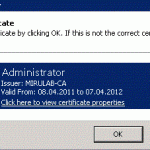

This article describes all steps to activate certificate based authentication to Outlook Web Application on Exchange 2010 / IIS 7.We assume here that you already have configured the SSL server certificate for the CAS server and the user accessing OWA has a valid user certificate for authentication installed.

  * Install certificate based auth feature

>   * Start a powershell console
>   * <pre>Import-Module ServerManager</pre>
> 
>   * <pre>Add-WindowsFeature web-client-auth</pre>

  *  Open IIS Manager and highlight the server name in the left hand pane 
      * Double click the Authentication icon in the middle pane.
      * Right click on Active Directory Client Certificate Authentication and select Enable.
      * Select the OWA virtual directory in the left pane under the Default Web Site.
      * Double click on the SSL Settings icon.
      * Set the Client Certificates radio button to Require.
      * Click Apply.

  * Unlock the IIS feature for certificate authentication  
    Run appcmd from %windir%\system32\inetsrv

>   * <pre><em>appcmd unlock config /section:clientCertificateMappingAuthentication</em></pre>
> 
>   * <pre><em>appcmd set config "Default Web Site/OWA" -section:clientCertificateMappingAuthentication /enabled:true</em></pre>

  

  * Configure the OWA virtual directory from the Exchange Management shell. This will turn off forms based authentication, set Windows Authentication and Basic Authentication to false. Users will be required to present a certificate to access OWA after this step.

  

>   * <pre><em>set-owavirtualdirectory  -identity "server-name\OWA (Default Web Site)"  -WindowsAuthentication:$false -BasicAuthentication:$false  FormsAuthentication:$False</em></pre>
> 
>   * <pre><em> </em><em>IISreset /noforce</em></pre>

> Opening the OWA url should now ask for the certificate
> 
> 

> 

 