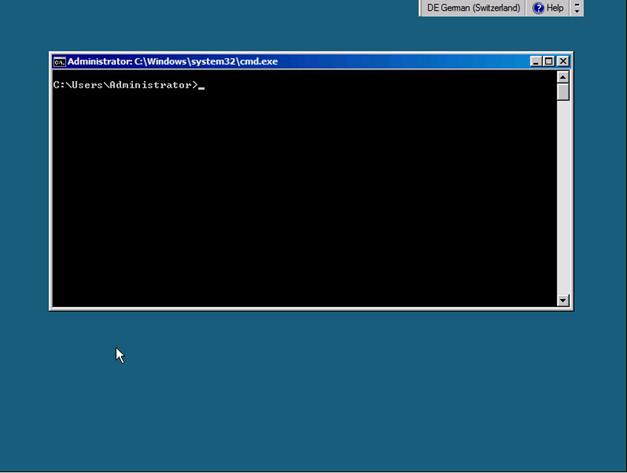

This week i decided to take myself into a Hyper-V installation running on a Server 2008 R2 SP1 Core. To share my experience and to conserve my own knowledge I&#8217;d like to share my personal experiences in this blog post.

# The start over

For each of you who haven&#8217;t seen a core server after initial image deploy, I&#8217;ve captured the scree after changing the admin password.

 

## Configuring Networking

List interfaces and note down the IDX numbers

Netsh interface ipv4 show interfaces  

Set the IP addess for the management interface

Netsh interface ipv4 set address name=&#8221;21&#8243; address=10.2.1.140 mask=255.255.255.0 gateway=10.2.1.1  

Set the DNS Servers

Netsh interface ipv4 add dnsserver name=&#8221;21&#8243; address=10.2.1.160 index=1  Netsh interface ipv4 add dnsserver name=&#8221;21&#8243; address=10.2.1.161 index=2  

Rename the host

Netdom renamecomputer localhost /NewName:SHYPVC01  

Join the host to a domain

Netdom join localhost /miru.lab /userD:<username> /passwordD:<password>  

Enable remote management

Cscript \windows\system32\scregedit.wsf /ar 0  

Netsh advfirewall set currentprofile settings remotemanagement enable  

Install Powershell

start /w ocsetup NetFx2-ServerCore  

start /w ocsetup MicrosoftWindowsPowerShell  

Enable Powershell Remoting

Start powershell from C:\windows\system32\windowspowershell\v1.0\

Enable-PSRemoting  

Install Hyper-V Role

start /w ocsetup Microsoft-Hyper-V  

So from now on, you&#8217;ll be much more comfortable using SCVMM and all the stuff of RSAT to remotely manage your core host. Server core requires you less patching and the possibility of getting rid of curious windows admins thinking &#8220;ehh. let&#8217;s have a look what that server does&#8221; and logging in just for fun by clicking around fancy GUIs. Me personally I think the core installation will become more important with Server 8, because there are dozens of new modules and thousands of new CMDLETS making it way better to manage a core instance via PowerShell.

More details about how to manage a Server core instance in a later article.

&nbsp;

&nbsp;

&nbsp;