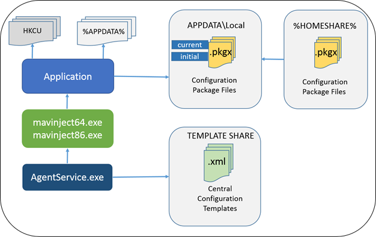
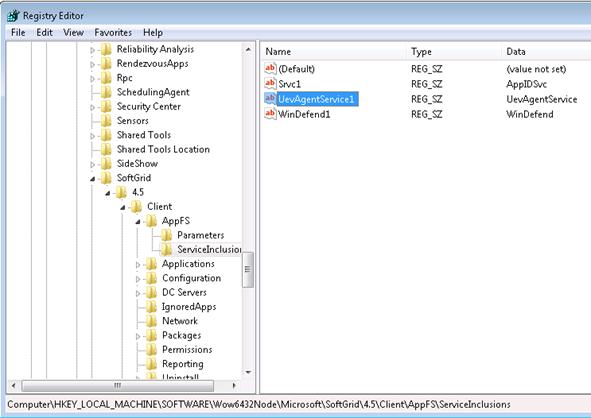

Microsoft UEV could be called as &#8220;just another profile management solution&#8221;. I agree it&#8217;s a bit late for MS to publish the solution as there are vendors like Appsense or RES, which focus on user virtualization and user workspace management since many years with success. In the meantime UEV can be a value add for customers which think traditional roaming profile just suck, but don&#8217;t want/can spend a fortune for a high end solution&#8230; and… It&#8217;s included in MDOP 2012. For an overview about UEV I&#8217;d like to refer to a geek mate of mine, [Helge Klein](http://helgeklein.com/blog/2012/04/microsoft-user-experience-virtualization-ue-v-facts-and-review/). Find his article [here](http://helgeklein.com/blog/2012/04/microsoft-user-experience-virtualization-ue-v-facts-and-review/).

I wanted to dig a bit deeper and find out how UEV is working under the hood.

<strong>Disclaimer:  At the time I wrote this article I did not find any official documentation on the application architecture of UEV 1.0. All stuff I&#8217;m sharing is based on own reverse engineering and may not be 100% correct.  </strong>

<strong>Components involved  </strong>

  <table style="border-collapse: collapse;" border="0">
    <colgroup> <col style="width: 274px;" /> <col style="width: 363px;" /></colgroup> <tr style="background: #ffd966;">
      <td style="padding-top: 2px; padding-left: 7px; padding-bottom: 2px; padding-right: 7px; border-top: none; border-bottom: solid #c9c9c9 1.5pt; border-right: none;">
        <strong>Component</strong>
      </td>
      
      <td style="padding-top: 2px; padding-left: 7px; padding-bottom: 2px; padding-right: 7px; border-top: none; border-left: none; border-bottom: solid #c9c9c9 1.5pt;">
        <strong>Description</strong>
      </td>
    </tr>
    
    <tr style="background: #ededed;">
      <td style="padding-top: 2px; padding-left: 7px; padding-bottom: 2px; padding-right: 7px; border-top: none; border-bottom: solid #c9c9c9 0.25pt; border-right: solid #c9c9c9 0.25pt;">
        <strong>Microsoft.Uev.AgentDriver.sys</strong>
      </td>
      
      <td style="padding-top: 2px; padding-left: 7px; padding-bottom: 2px; padding-right: 7px; border-top: none; border-left: none; border-bottom: solid #c9c9c9 0.25pt;">
        File System Filter Driver
      </td>
    </tr>
    
    <tr>
      <td style="padding-top: 2px; padding-left: 7px; padding-bottom: 2px; padding-right: 7px; border-top: none; border-bottom: solid #c9c9c9 0.25pt; border-right: solid #c9c9c9 0.25pt;">
        <strong>AgentService.exe</strong>
      </td>
      
      <td style="padding-top: 2px; padding-left: 7px; padding-bottom: 2px; padding-right: 7px; border-top: none; border-left: none; border-bottom: solid #c9c9c9 0.25pt;">
        UEV Agent Core Service
      </td>
    </tr>
    
    <tr style="background: #ededed;">
      <td style="padding-top: 2px; padding-left: 7px; padding-bottom: 2px; padding-right: 7px; border-top: none; border-bottom: solid #c9c9c9 0.25pt; border-right: solid #c9c9c9 0.25pt;">
        <strong>UevTrayApp.exe</strong>
      </td>
      
      <td style="padding-top: 2px; padding-left: 7px; padding-bottom: 2px; padding-right: 7px; border-top: none; border-left: none; border-bottom: solid #c9c9c9 0.25pt;">
      </td>
    </tr>
    
    <tr>
      <td style="padding-top: 2px; padding-left: 7px; padding-bottom: 2px; padding-right: 7px; border-top: none; border-bottom: solid #c9c9c9 0.25pt; border-right: solid #c9c9c9 0.25pt;">
        <strong>mavinject64.exe</strong>
      </td>
      
      <td style="padding-top: 2px; padding-left: 7px; padding-bottom: 2px; padding-right: 7px; border-top: none; border-left: none; border-bottom: solid #c9c9c9 0.25pt;">
        Usermode process launched by AgentService.exe which Injects into application start / stop sequence. It reads settings from the package file at startup and injects them into the real registry. When the application is shut down it injects again and reads from the real registry to save the settings in the package file.
      </td>
    </tr>
    
    <tr style="background: #ededed;">
      <td style="padding-top: 2px; padding-left: 7px; padding-bottom: 2px; padding-right: 7px; border-top: none; border-bottom: solid #c9c9c9 0.25pt; border-right: solid #c9c9c9 0.25pt;">
        <strong>mavinject32.exe</strong>
      </td>
      
      <td style="padding-top: 2px; padding-left: 7px; padding-bottom: 2px; padding-right: 7px; border-top: none; border-left: none; border-bottom: solid #c9c9c9 0.25pt;">
        Same as mavinject64.exe but for 32-bit processes.
      </td>
    </tr>
    
    <tr>
      <td style="padding-top: 2px; padding-left: 7px; padding-bottom: 2px; padding-right: 7px; border-top: none; border-bottom: solid #c9c9c9 0.25pt; border-right: solid #c9c9c9 0.25pt;">
        <strong>Microsoft.Uev.AppAgent.dll</strong>
      </td>
      
      <td style="padding-top: 2px; padding-left: 7px; padding-bottom: 2px; padding-right: 7px; border-top: none; border-left: none; border-bottom: solid #c9c9c9 0.25pt;">
      </td>
    </tr>
    
    <tr style="background: #ededed;">
      <td style="padding-top: 2px; padding-left: 7px; padding-bottom: 2px; padding-right: 7px; border-top: none; border-bottom: solid #c9c9c9 0.25pt; border-right: solid #c9c9c9 0.25pt;">
        <strong>ApplicationXXX.xml</strong>
      </td>
      
      <td style="padding-top: 2px; padding-left: 7px; padding-bottom: 2px; padding-right: 7px; border-top: none; border-left: none; border-bottom: solid #c9c9c9 0.25pt;">
        XML Application Settings Template containing HKCU Keys and Folders from User Profile to capture
      </td>
    </tr>
    
    <tr>
      <td style="padding-top: 2px; padding-left: 7px; padding-bottom: 2px; padding-right: 7px; border-top: none; border-bottom: solid #c9c9c9 0.25pt; border-right: solid #c9c9c9 0.25pt;">
        <strong>ApplicationXXX.pkgx</strong>
      </td>
      
      <td style="padding-top: 2px; padding-left: 7px; padding-bottom: 2px; padding-right: 7px; border-top: none; border-left: none; border-bottom: solid #c9c9c9 0.25pt;">
        Binary Application Settings Package File containing the settings. It can be extracted to plain XML by using the PS CMDLETExport-UevPackage
      </td>
    </tr>
  </table>

&nbsp;

### **Service Architecture**

 

&nbsp;

<strong>Settings that are captured  </strong>

  * HKCU Registry Hive
  * Folders and Files in %USERPROFILE%

&nbsp;

&nbsp;

<strong>How to exclude / include file types  </strong>

Currently UEV only includes an exclusion filter for file types. To edit or add additional excluded file types you have to edit the following registry key:

HKEY\_LOCAL\_MACHINE\SOFTWARE\Microsoft\UEV\Agent\Configuration\ExcludedFileTypes

Unfortunately I didn&#8217;t see any possibility to manage the exclusions centrally.

&nbsp;

&nbsp;

### **What about App-V?**

 For more information about App-V service and process inclusions refer to this post:

<http://blogs.technet.com/b/gladiatormsft/archive/2012/08/01/app-v-4-6-using-service-and-process-inclusions.aspx>

&nbsp;

&nbsp;

<strong>Current Limitations  </strong>

  * The UEV Agent is not able to capture files and folders outside the %USERPROFILE% directory
  * Restoring of application settings to initial values across multiple machines is not possible because the initial settings are stored under:  
    %USERPROFILE%\APPDATA\Local\Microsoft\UEV\%COMPUTERNAME%\TemplateName\
  * There is no history of the settings to roll them back to a certain date

### 

### <strong>UEV Resources  </strong>

UEV Agent Registry Settings  
<http://support.microsoft.com/kb/2770042>

UEV on Technet  
<http://technet.microsoft.com/en-us/library/jj680015.aspx>

Installing UEV Group Policy Templates  
<http://technet.microsoft.com/en-us/library/jj679980.aspx>

Managing UE-V 1.0 Settings Location Templates Using PowerShell  
<http://technet.microsoft.com/en-us/library/jj679987.aspx>

UEV Configuration Template Gallery  
<http://gallery.technet.microsoft.com/site/search?f[0].Type=RootCategory&f[0].Value=UE-V>

How To Enable Debug Logging in Microsoft User Experience Virtualization (UE-V)  
<http://support.microsoft.com/kb/2782997>

&nbsp;

&nbsp;

&nbsp;

&nbsp;

&nbsp;