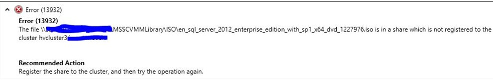

**Scenario:  
** 

  * You&#8217;re using SMB based storage for virtual machines on your Hyper-V hosts
  * You have virtual machines with attached AND shared ISO images on a share or the SCVMM library
  * You remove and re-add the host running the corresponding VMs in SCVMM
  * You re-register the SMB file share to the cluster or host
  * You refresh the virtual machines inventory

&nbsp;

**Error:  
** 

Each VM with a previously attached, shared ISO image fails to refresh with the following error message:

 

As a result the VM is in an &#8220;Unsupported VM Configuration&#8221; state and there is no way to get rid of the attached ISO within SCVMM Console or SCVMM Powershell CMDLETs.

&nbsp;

**Reason:  
** 

It seems that the ISO files previously attached in shared mode have a direct reference to the SMB file share of the virtual machine files, even if the ISO is located on an independent share or SCVMM library share.

&nbsp;

**Solution:  
** 

Of course we&#8217;ll use Powershell here as we are lazy and don&#8217;t want to click around for a fair amount of time.

  1. 

      Get all the VMs with the corresponding error state
    

    
    <pre>Get-SCVMHost HV7 | Get-SCVirtualMachine | ? {$_.Status -eq 'UnsupportedSharedFiles'} | Select Name,State,VMHost</pre>

  2. 

      For each affected VM open a Powershell Remote Session to the corresponding host and detach all connected ISO files
    

    
    <pre>Get-VMDvdDrive -VMName SomeVMName | Set-VMDvdDrive -Path $null</pre>

If the VM is clustered you have to install the Clustering Powershell Module. (Add-WindowsFeature RSAT-Clustering-Powershell)

Also you&#8217;ll get a Warning message while detaching the ISOs on a clustered VM, but you can safely ignore this one.

If someone finds a way to do that in a one liner from remote, please let me know. The Clustering CMDLETS lack in remoting capabilities IMHO.

&nbsp;