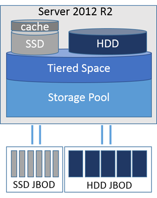
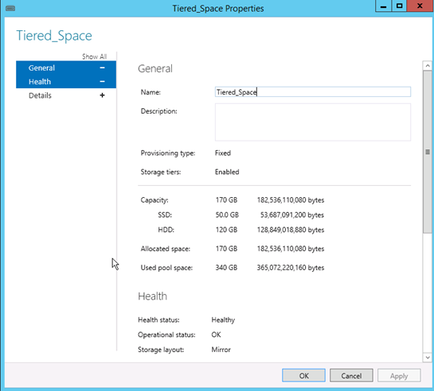

Storage Spaces is a technology Microsoft introduced with Server 2012. It allows creation of high performing, redundant and flexible storage architectures using common hard disks (JBOD).

For an introduction and general concepts about Storage Spaces see here:

<http://technet.microsoft.com/en-us/library/hh831739.aspx>

<http://blogs.msdn.com/b/b8/archive/2012/01/05/virtualizing-storage-for-scale-resiliency-and-efficiency.aspx>

Now with the R2 version of Server 2012 Microsoft enhanced the features by adding automatic storage tiering and write-back cache. In this post I&#8217;m going to cover step by step how to create a tiered space.

**Storage Tiering** 

Storage tiering in Server 2012 R2 knows about two tiers. A HDD tier and an SSD tier, meaning one for traditional spinning drives and one for solid state drives. It automatically detects the drive type of physical disks.  
Windows automatically discovers which parts of a storage space are access more frequently and heavily than others and moves them to an SSD tier. The data is moved based on 1MB junks. This has basically two benefits. It combines two common requirements in one single solution out of the box. Maximized capacity and maximized performance, which generally don&#8217;t go well together. Storage Tiering also allows manual pinning of complete files to a particular storage tier. This allows administrators two permanently map files to an SSD or HDD tier.

**Write-Back Cache** 

This is like a staging area for write IO and lies on a SSD space. Like other vendors as NetApp provide flash cash extensions for read IO, write-back cache is only for writes. You as an Administrator define the size of the write-back cache at will depending on the available SSD capacity. Microsoft recommends to leave the write-back cache at the default of 1GB. Significant improvements have not been observed by using larger WBC. The WBC gets destaged at a fill level between 25%-50%. So if you have a large WBC, the destage process to HDD can take some time and lead to congestion of your HDD tier.

**How this fits all together…** 

 

&nbsp;

<strong>How to create a tiered storage space </strong>

**Requirements:** (we will create a simple mirrored space)

  * 3 or more SAS or SATA disks
  * 3 or more SSD disks
  * As you might guess already, this is only available through Powershell, at least in the preview version of R2

&nbsp;

<pre>#Get physical disks that can be pooled
$pooldisks = get-physicaldisk | ? {$_.canpool -eq $true}</pre>

<pre>#Create new tiered storage pool 
New-StoragePool -StorageSubSystemFriendlyName *Spaces* -FriendlyName TieredPool1 -PhysicalDisks $pooldisks</pre>

<pre>#Check the media type of the disks in the pool 
Get-StoragePool -FriendlyName TieredPool1 | Get-PhysicalDisk | Select FriendlyName, MediaType, Size</pre>

<pre>#Create SSD Tier 
$tier_ssd = New-StorageTier -StoragePoolFriendlyName TieredPool1 -FriendlyName SSD_TIER -MediaType SSD</pre>

<pre>#Create HDD Tier 
$tier_hdd = New-StorageTier -StoragePoolFriendlyName TieredPool1 -FriendlyName HDD_TIER -MediaType HDD</pre>

<pre>#Create a tiered Storage Space (virtual disk) with write-back cache enabled 
$vdisk1 = New-VirtualDisk -StoragePoolFriendlyName TieredPool1 -FriendlyName Tiered_Space -StorageTiers @($tier_ssd, $tier_hdd) -StorageTierSizes @(50GB, 120GB) -ResiliencySettingName Mirror -WriteCacheSize 5GB</pre>

<pre>#Initialize virtual disk, Create Partition and Volume, Assign Drive Letter 
Get-VirtualDisk -FriendlyName Tiered_Space | Get-Disk | Initialize-Disk –Passthru  | New-Partition –AssignDriveLetter –UseMaximumSize | Format-Volume -force -Confirm:$false</pre>

In the Server Manager you should now see a tiered space

 **  
** 

&nbsp;

**How to simulate storage tiering within a virtual machine?** 

Of course this is not meant for production use, you can override the media type of physical disks within a storage pool to simulate tiering within a VM. To see any differences I recommend to place your virtual hard disks for the virtual machines on different types of storage. Eg. On USB for HDD tier and on SSD for SSD tier, so you can see the performance gains also in your LAB environment.

<pre>#Override Media Type for large disks
Get-StoragePool -FriendlyName TieredPool1 | Get-PhysicalDisk | ? {$_.Size -eq 106568876032} | Set-PhysicalDisk -MediaType HDD
 </pre>

&nbsp;

In this example I override the media type of all disks (vhds) with a size of 100GB. You could use also other filter strings of course.

**How to map files consistently to a storage tier** 

Taking a VDI deployment of pooled VMs typical scenario could make sense, because you might want to map the parent VHD of your master image to the SSD tier, as every pooled VM booting up reads from this file. So how can you permanently map files to a SSD or HDD storage tier?

<pre>#Assign a frequent accessed file permanently to the SSD Tier 
Set-FileStorageTier -FilePath E:\PoolVMParent.VHD -DesiredStorageTier ($vdisk1 | Get-StorageTier -MediaType SSD)</pre>

<pre>#Get the tiered file mapping list and the Status
 Get-FileStorageTier -VolumeDriveLetter E</pre>

<pre>#Trigger the data movement 
Optimize-Volume -DriveLetter E -TierOptimize</pre>

&nbsp;

**How Windows manages tier / volume optimization** 

A scheduled task named &#8220;Storage Tiers Optimization&#8221; runs at 01:00 am by default. The task runs a defrag command:

<pre>defrag.exe /C /H /G</pre>

The parameter /G is new and used to optimize storage tiered volumes. You can adjust the task of course or create additional ones to match your requirements.

Disclaimer: This post shows features from the preview version of Server 2012 R2. Things might Change in the RTM.