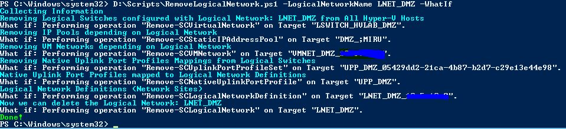

Deleting a Logical Network within VMM can be painful if it&#8217;s already configured end-to-end, meaning all components plugged together and Hyper-V Hosts equipped with a Logical Switch accordingly. If you&#8217;re not an expert on how the different components are plumbed together, you&#8217;ll probably waste a lot of time digging the various dependencies. To save also time for my own while playing in LAB and Demo environments I created a little Powershell script that does all the work for me. It performs the following steps.

  * Gather dependency information from Logical Networks, Network Sites, IP Pools, VM Networks, Uplink Port Profiles and Logical Switches relying on the Logical Network to be deleted
  * Delete the components in the correct order

The Script fully supports the **-whatif p**arameter, so you can see what the script would delete, before you screw up your SDN 🙂

I decided to remove the Logical Switch the Logical Network belongs to from all affected Hyper-V Hosts. The Logical Switch as an object itself, is left alone, so the script doesn&#8217;t touch it. You can modify the script according your needs of course.

And here is how you run the script:

<pre>RemoveLogicalNetwork.ps1 -LogicalNetworkName "LNET_LAB_01" -whatif</pre>

<pre>RemoveLogicalNetwork.ps1 -LogicalNetworkName "LNET_LAB_01"</pre>

Get the script [**here**](../images/2013/08/RemoveLogicalNetwork.zip) and feel free to extend it or write me feedback and comments.

&nbsp;