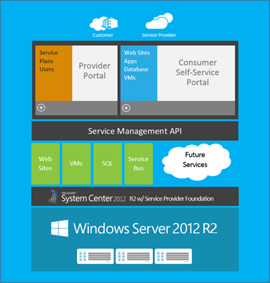
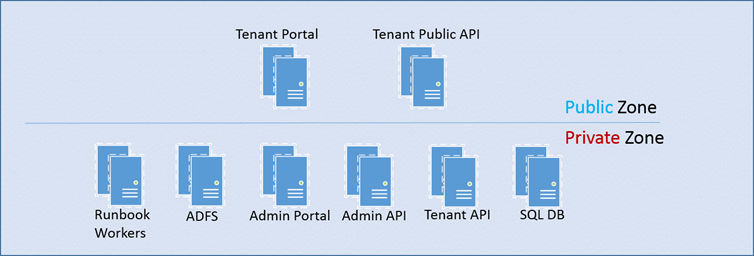
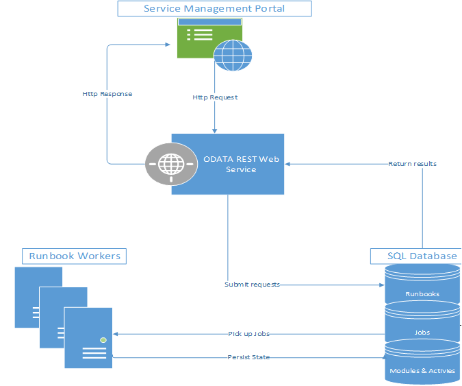

Windows Azure Pack (codename &#8220;KATAL&#8221;) has been released together with the R2 wave of the Server and System Center platform. Windows Azure Pack, I&#8217;ll call it WAP in this post brings Azure style self-service and automation to your private cloud.

The following picture illustrates the architecture from a high level perspective.

  
Source: Microsoft

&nbsp;

OK, you might think, but why should I have a look at it, it&#8217;s intended for service providers to deliver azure style cloud services to their customers. You&#8217;d be completely wrong!

Well if you ever wanted to enable self-service for virtual machines you probably came along System Center App Controller which enables deployment of virtual machines and services out of a Silverlight based Web Portal. App Controller is there since System Center Virtual Machine Manager 2012 SP1 and also has an interface to Windows Azure, meaning you can deploy virtual machines and services to your private IAAS or to Windows Azure from a single Web Console. Now there are some limitations to that:

  * Adding virtual disks to deployed machines is not possible
  * Creating own networks using Network Virtualization as you can on Windows Azure is not possible
  * Connecting s virtual machines to more than one network after deployment is not possible
  * App Controller can only deploy virtual machines and services, but now SQL or MySQL databases or web sites
  * The automation framework is very limited
  * Remote VM Console connect is not possible from the internet without exposing your infrastructure

## Here&#8217;s where WAP can help you out. It extends your investments in an IAAS by the following functionalities:

  * Deployment of Standalone Virtual Machines
  * Deployment of Virtual Machine Roles and Services
  * Creation of virtual networks using HNV (host network virtualization)
  * Creation of Site-2-Site, Point-2-Site VPN connections
  * Creation of NAT Rules for virtual networks and underlying VMs
  * Remote Console Connect for Windows and Linux VMs via a RD Gateway
  * Deployment of SQL database instances (standalone or always on)
  * Deployment of MySQL database instances
  * Deployment of service bus instances as a message bus for your applications
  * Deployment of Web Site instances
  * Creation of own automation workflows using the Service Management Automation (SMA) framework
  * Generation of resource usage reports
  * Consistent Admin and End-user experience with Windows Azure

## Basic Requirements to deploy Windows Azure Pack in a PoC

  * Windows 2012 R2 with Hyper-V enabled as the virtualization platform
  * System Center Virtual Machine Manager 2012 R2
  * 

      Service Provider Foundation 2012 R2 (part of Orchestrator Install Media)
    

    
      * Windows Server 2012 or higher
      * SQL Server 2012 SP1 or higher
      * Some pre-requisites J (<http://technet.microsoft.com/en-us/library/jj134242.aspx>)
  * 

      Windows Azure Pack Portals and APIs (available via single web platform installer)
    

    
      * Windows Server 2012 or higher
      * .NET 3 / 4
      * IIS
      * SQL Server 2012 SP1 or higher
  * 

      A single VM fits for all components in this scenario
    

    
    

      </li> </ul> 
      
      <h2>
        Basic Requirements to deploy Windows Azure Pack in a full featured and scalable set
      </h2>
      
      <ul>
        <li>
          Same applies as above but you&#8217;ll need a bunch of virtual machines to host the different components if they have to be (IMHO they must be) redundant.
        </li>
      </ul>
      
      

        
      

      
      <h1>
        What about a scalable Automation Framework?
      </h1>
      
      

        We all know the good old System Center Orchestrator, a relatively cool solution to automate the datacenter with a tight integration into most of the System Center product family. Some years back, in December 2009 to be more precise, Microsoft acquired Opalis Software, a company delivering task automation and orchestration SW. But we also know, that the code from Opalis does not fit into MSFT&#8217;s coding concept and they would have to rebuild it from ground up to match the other System Center components concept. And here it is…
      

      
      

        Service Management Automation Framework as a part of Windows Azure Pack. You can install WAP without the need to provision virtual machines, web sites or databases because SMA runs as a separate set of components. Powershell 3.0 / 4.0 Workflows are the foundation of SMA, so if you&#8217;ve already invested in Orchestrator Runbooks executing Powershell Workflows, you can easily transfer them into SMA. If you&#8217;ve mainly used built-in Runbook activities, it&#8217;s time to think about switching to native Powershell code. Why? Because I truly believe that SCORCH will be replaced by the SMA architecture in the future. And before you ask me this, No, I don&#8217;t have any official information about that from Microsoft or other sources. Even if I would I&#8217;m sure this would be under NDA J. This is just my personal point of view when I look at the improvements in Orchestrator 2012 R2. Are there any big ones?
      

      
      

        SMA is highly scalable and flexible, because it relies 100% on a oDATA REST API as well as Powershell and its workflow architecture.
      

      
      

        <strong>Here&#8217;s another helicopter view, this time on the SMA architectur</strong>e.
      

      
      

        
      

      
      

        Source: Microsoft
      

      
      

        &nbsp;
      

      
      

        Stay tuned…In a next Blog Post I&#8217;ll give you a closer look inside the SMA framework and how to use it.
      

      
      <h2>
        Useful Resources
      </h2>
      
      <ul>
        <li>
          WAP on Technet (<a href="http://technet.microsoft.com/en-us/library/dn296435.aspx">http://technet.microsoft.com/en-us/library/dn296435.aspx</a>)
        </li>
        <li>
          Windows Azure Pack Wiki (<a href="http://social.technet.microsoft.com/wiki/contents/articles/20689.wap-wiki-a-collection-of-windows-azure-pack-and-related-blogs-videos-and-technet-articles.aspx">http://social.technet.microsoft.com/wiki/contents/articles/20689.wap-wiki-a-collection-of-windows-azure-pack-and-related-blogs-videos-and-technet-articles.aspx</a>)
        </li>
        <li>
          Getting started with Gallery Items (<a href="http://kristiannese.blogspot.ch/2013/08/getting-started-with-gallery-items-in.html">http://kristiannese.blogspot.ch/2013/08/getting-started-with-gallery-items-in.html</a>)
        </li>
        <li>
          

            Powershell Workflow Concepts (<a href="http://technet.microsoft.com/en-us/library/jj134242.aspx">http://technet.microsoft.com/en-us/library/jj134242.aspx</a>)
          

        </li>
      </ul>
      
      

        &nbsp;
      
