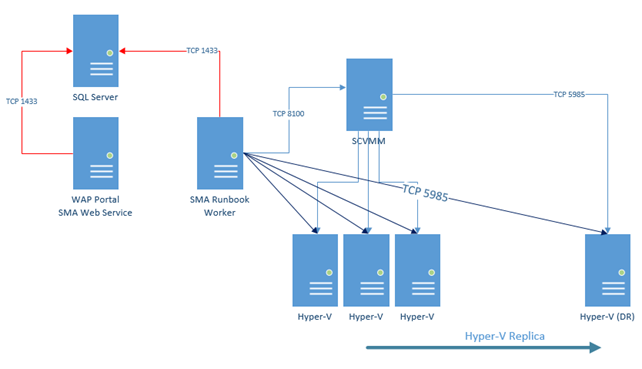
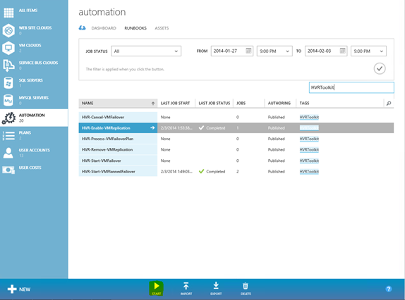
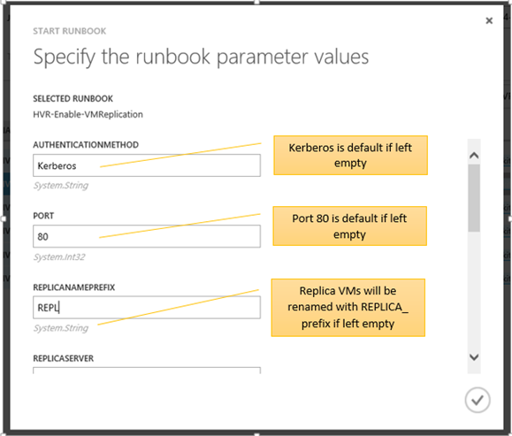
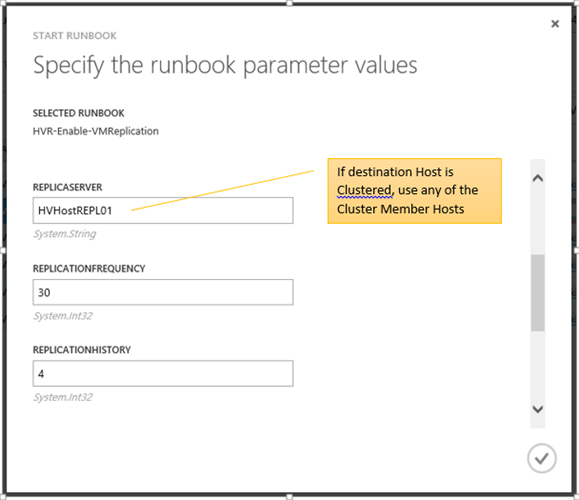
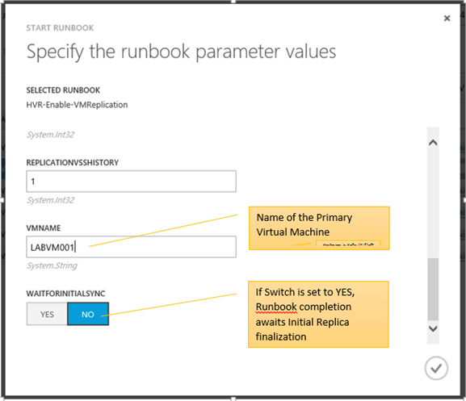
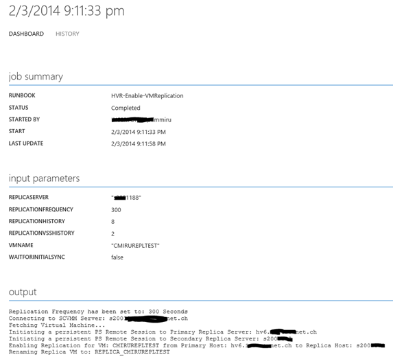
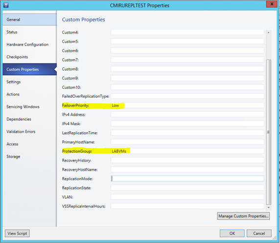
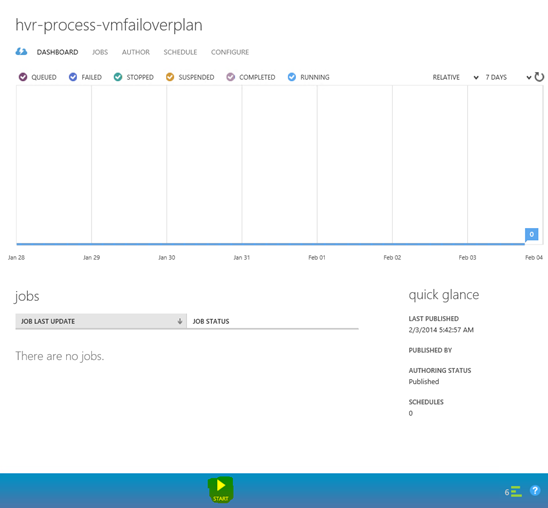
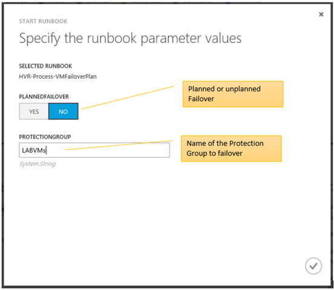
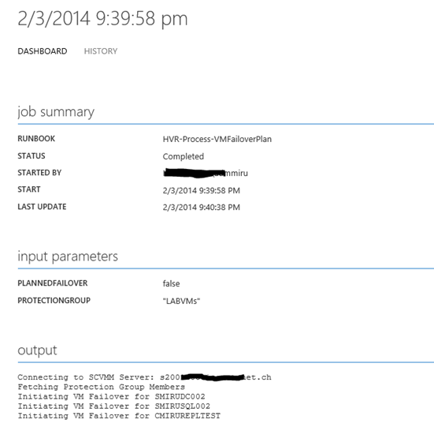

Some days ago I published a whitepaper about Service Management Automation (SMA) using Windows Azure Pack. It covers a basic guide through setup and operating SMA inside your private/hybrid cloud environment. You can get the Whitepaper [here on TechNet](http://gallery.technet.microsoft.com/Service-Management-fcd75828).

Now, some days later I&#8217;m happy to publish more real life examples demonstrating the power and flexibility of SMA. In this post I&#8217;m going to introduce my brand new &#8220;Hyper-V Replica SMA Automation Toolkit&#8221;.

So first said, if you shouldn&#8217;t have a clue about Hyper-V Recovery Manager nor Hyper-V Replica, you might be wrong here. However, if you&#8217;re interested in this amazing technologies I&#8217;d recommend some good reads about Hyper-V Recovery Manager and Hyper-V Replica in general.

Hyper-V Replica  

<http://blogs.technet.com/b/yungchou/archive/2013/01/10/hyper-v-replica-explained.aspx>

<http://www.microsoft.com/en-us/download/details.aspx?id=29016>

Hyper-V Recovery Manager  

<http://www.thomasmaurer.ch/2014/01/hyper-v-recovery-manager-hrm-faq/>

&nbsp;

But back to the toolkit itself. What does it do and why did I create it?

## Purpose of the HVRSMA Toolkit

  * Demonstration of SMA capabilities
  * Creation of new Hyper-V Replica relationships
  * Failover of Hyper-V Replica protected VMs
  * Planned Failover of Hyper-V Replica protected VMs
  * Cancel Failover of Hyper-V Replica protected VMs
  * Remove VM Replication
  * Orchestrate multiple VM failover process using Protection Groups

All runbooks support either single-to-single host Replica, Cluster-to-single host Replica, Single host to Cluster Replica and Cluster-to-Cluster Replica.

  <h2>
    Why did I create a bunch of SMA Runbooks while we have Hyper-V Replica Manager ready to use on Azure?
  </h2>
  
  

    There might be some difficulties regarding legal regulations when you are working in the financial industry, especially in the EU or even more in Switzerland. So although I think Hyper-V Recovery Manager is the way to go, sometimes it&#8217;s just impossible by the momentum and the facts given to adopt it for regulation terms, as it&#8217;s still a cloud service. And.. yes.. I&#8217;m truly aware that Hyper-V Recovery Manager doesn&#8217;t transfer any data to or from Azure, but only maintains a secure communications channel between your SCVMM and your Windows Azure subscription. So the main reason was to show the almost endless possibilities of SMA and of course hand you over an alternative to automate Hyper-V Replica within your private cloud where Hyper-V Recovery Manager is not an option right now.
  

  
  <h2>
    How the toolkit works and which prerequisites it requires
  </h2>
  
  

    &nbsp;
  

  
  

    Overview  
  

  
  

    
  

  
  

    &nbsp;
  

  
  

    Prerequisites  
  

  
  <ul>
    <li>
      SCVMM Console installed on all SMA Runbook Workers
    </li>
    <li>
      WinRM Connection from all SMA Runbook Workers to all primary and secondary Hyper-V Hosts
    </li>
    <li>
      SMA SCVMM Connection Object (created during the install process of the toolkit)
    </li>
    <li>
      User account with administrative permission on the Hyper-V hosts
    </li>
    <li>
      SMA Credential Object for the Hyper-V admin user account (created during the install process of the toolkit)
    </li>
  </ul>
  
  

    &nbsp;
  

  
  <h2>
    How to install the toolkit
  </h2>
  
  <ul>
    <li>
      Extract the ZIP file to a local folder <strong>on one of your SMA Runbook Workers</strong>
    </li>
    <li>
      Open a Powershell Console and change to the extracted folder
    </li>
    <li>
      Run the HVRToolkitInstall.ps1 script to import all runbooks and assets into SMA.
    </li>
  </ul>
  
  

    .\HVRToolkitInstall.ps1 –SMAWebServiceEndpoint <a href="https://sma.demonet.ch">https://sma.demonet.ch</a>  
  

  
  

    The installation process will ask you for some parameters such as the <strong>FQDN of SCVMM</strong>, a <strong>username</strong> and <strong>password</strong> for the <strong>SCVMM connection</strong>
  

  
  

    as well as <strong>username</strong> and <strong>password</strong> for the SMA credential object <strong>used to connect to Hyper-V Hosts</strong> via WinRM
  

  
  

    &nbsp;
  

  
  <h2>
    How to use it
  </h2>
  
  

    After running the installation script, you should have the following new SMA Runbooks / Assets imported:
  

  
  

    <table style="border-collapse: collapse;" border="0">
      <colgroup> <col style="width: 217px;" /> <col style="width: 151px;" /> <col style="width: 331px;" /></colgroup> <tr style="background: #00b0f0;">
        <td style="padding-left: 7px; padding-right: 7px; border: solid 0.5pt;">
          <strong>Name</strong>
        </td>
        
        <td style="padding-left: 7px; padding-right: 7px; border-top: solid 0.5pt; border-left: none; border-bottom: solid 0.5pt; border-right: solid 0.5pt;">
          <strong>Type</strong>
        </td>
        
        <td style="padding-left: 7px; padding-right: 7px; border-top: solid 0.5pt; border-left: none; border-bottom: solid 0.5pt; border-right: solid 0.5pt;">
          <strong>Description</strong>
        </td>
      </tr>
      
      <tr>
        <td style="padding-left: 7px; padding-right: 7px; border-top: none; border-left: solid 0.5pt; border-bottom: solid 0.5pt; border-right: solid 0.5pt;">
          HVR-Enable-VMReplication
        </td>
        
        <td style="padding-left: 7px; padding-right: 7px; border-top: none; border-left: none; border-bottom: solid 0.5pt; border-right: solid 0.5pt;">
          Runbook
        </td>
        
        <td style="padding-left: 7px; padding-right: 7px; border-top: none; border-left: none; border-bottom: solid 0.5pt; border-right: solid 0.5pt;">
          Create a new Replica relationship for a single VM
        </td>
      </tr>
      
      <tr>
        <td style="padding-left: 7px; padding-right: 7px; border-top: none; border-left: solid 0.5pt; border-bottom: solid 0.5pt; border-right: solid 0.5pt;">
          HVR-Remove-VMReplication
        </td>
        
        <td style="padding-left: 7px; padding-right: 7px; border-top: none; border-left: none; border-bottom: solid 0.5pt; border-right: solid 0.5pt;">
          Runbook
        </td>
        
        <td style="padding-left: 7px; padding-right: 7px; border-top: none; border-left: none; border-bottom: solid 0.5pt; border-right: solid 0.5pt;">
          Remove a Replica relationship for a single VM and optionally delete the replica
        </td>
      </tr>
      
      <tr>
        <td style="padding-left: 7px; padding-right: 7px; border-top: none; border-left: solid 0.5pt; border-bottom: solid 0.5pt; border-right: solid 0.5pt;">
          HVR-Start-VMPlannedFailover
        </td>
        
        <td style="padding-left: 7px; padding-right: 7px; border-top: none; border-left: none; border-bottom: solid 0.5pt; border-right: solid 0.5pt;">
          Runbook
        </td>
        
        <td style="padding-left: 7px; padding-right: 7px; border-top: none; border-left: none; border-bottom: solid 0.5pt; border-right: solid 0.5pt;">
          Initiate a planned failover for a single VM (including reversing the replication direction)
        </td>
      </tr>
      
      <tr>
        <td style="padding-left: 7px; padding-right: 7px; border-top: none; border-left: solid 0.5pt; border-bottom: solid 0.5pt; border-right: solid 0.5pt;">
          HVR-Start-VMFailover
        </td>
        
        <td style="padding-left: 7px; padding-right: 7px; border-top: none; border-left: none; border-bottom: solid 0.5pt; border-right: solid 0.5pt;">
          Runbook
        </td>
        
        <td style="padding-left: 7px; padding-right: 7px; border-top: none; border-left: none; border-bottom: solid 0.5pt; border-right: solid 0.5pt;">
          Initiate a failover for a single VM
        </td>
      </tr>
      
      <tr>
        <td style="padding-left: 7px; padding-right: 7px; border-top: none; border-left: solid 0.5pt; border-bottom: solid 0.5pt; border-right: solid 0.5pt;">
          HVR-Cancel-VMFailover
        </td>
        
        <td style="padding-left: 7px; padding-right: 7px; border-top: none; border-left: none; border-bottom: solid 0.5pt; border-right: solid 0.5pt;">
          Runbook
        </td>
        
        <td style="padding-left: 7px; padding-right: 7px; border-top: none; border-left: none; border-bottom: solid 0.5pt; border-right: solid 0.5pt;">
          Cancel a previous failover of a single VM
        </td>
      </tr>
      
      <tr>
        <td style="padding-left: 7px; padding-right: 7px; border-top: none; border-left: solid 0.5pt; border-bottom: solid 0.5pt; border-right: solid 0.5pt;">
          HVR-Process-VMFailoverPlan
        </td>
        
        <td style="padding-left: 7px; padding-right: 7px; border-top: none; border-left: none; border-bottom: solid 0.5pt; border-right: solid 0.5pt;">
          Runbook
        </td>
        
        <td style="padding-left: 7px; padding-right: 7px; border-top: none; border-left: none; border-bottom: solid 0.5pt; border-right: solid 0.5pt;">
          Initiate a failover for multiple VMs where the VMM CustomProperty &#8220;ProtectionGroup&#8221; has been set. Respect the priority high,medium,low by initiating the failover in parallel for high tagged VMs first.
        </td>
      </tr>
      
      <tr>
        <td style="padding-left: 7px; padding-right: 7px; border-top: none; border-left: solid 0.5pt; border-bottom: solid 0.5pt; border-right: solid 0.5pt;">
          SCVMM
        </td>
        
        <td style="padding-left: 7px; padding-right: 7px; border-top: none; border-left: none; border-bottom: solid 0.5pt; border-right: solid 0.5pt;">
          VirtualMachineManager Connection Object
        </td>
        
        <td style="padding-left: 7px; padding-right: 7px; border-top: none; border-left: none; border-bottom: solid 0.5pt; border-right: solid 0.5pt;">
          A SMA Connection object including the SCVMM Hostname, Username and Password to connect
        </td>
      </tr>
      
      <tr>
        <td style="padding-left: 7px; padding-right: 7px; border-top: none; border-left: solid 0.5pt; border-bottom: solid 0.5pt; border-right: solid 0.5pt;">
          HVHostManagement
        </td>
        
        <td style="padding-left: 7px; padding-right: 7px; border-top: none; border-left: none; border-bottom: solid 0.5pt; border-right: solid 0.5pt;">
          Credential Object
        </td>
        
        <td style="padding-left: 7px; padding-right: 7px; border-top: none; border-left: none; border-bottom: solid 0.5pt; border-right: solid 0.5pt;">
          A SMA Credential object including the Username and Password to connect to Hyper-V Hosts using WinRM
        </td>
      </tr>
    </table>
  

  
  

    &nbsp;
  

  
  <h2>
    Some Examples
  </h2>
  
  <h3>
    Enabling a new Replica Relationship
  </h3>
  
  

    Start the runbook
  

  
  

    
  

  
  

    Fill out the Runbook Parameters
  

  
  

    
  

  
  

    
  

  
  

    
  

  
  

    Viewing the Job Output
  

  
  

    
  

  
  

    &nbsp;
  

  
  <h3>
    Process a regular or planned Failover for a Group of VMs
  </h3>
  
  

    Configure the primary VMs within SCVMM by setting the <strong>ProtectionGroup</strong> and <strong>FailoverPriority</strong> Custom Properties. Group your VMs for the failover priority by either setting a value of High | Medium | Low. The Protection Group Name is used to failover all VMs matching the same Value.
  

  
  

    
  

  
  

    Kick off the Runbook
  

  
  

    
  

  
  

    Set the Parameters
  

  
  

    
  

  
  

    View the Job Status
  

  
  

    
  

  
  

    &nbsp;
  

  
  <h2>
    Current Limitations / Known Issues
  </h2>
  
  <ul>
    <li>
      Works only with single SCVMM deployment, dual SCVMM deployment support will be included in a future version
    </li>
    <li>
      Removing a replication where the Replica Config is in an inconsistent state will fail
    </li>
    <li>
      Sometimes, deleting the Replica VM may fail if HVR-Remove-VMReplication is invoked with RemoveReplica switch set to YES
    </li>
    <li>
      Protection Groups support the following naming: High | Medium | Low . Other names are currently not supported.
    </li>
    <li>
      Most of the runbooks do not properly support &#8220;Resuming&#8221; if stopped because of a raised exception
    </li>
    <li>
      The Toolkit does not yet support tertiary replication setups and configurations
    </li>
  </ul>
  
  <h2>
    Where to get the tookit?
  </h2>
  
  

    Download the Toolkit <a href="http://gallery.technet.microsoft.com/Hyper-V-Replica-Automation-8b1d54b3/file/108126/1/HVR_SMA_Toolkit.zip"><strong>here from TechNet</strong></a>
  

  
  <h2>
    Feedback, Bug Reporting and Q+A
  </h2>
  
  

    Please use the Q+A section on TechNet to get in touch and to report bugs or request features.
  

  
  <h2>
    Disclaimer
  </h2>
  
  

    THE SAMPLE CODE AND ANY RELATED INFORMATION ARE PROVIDED &#8220;AS IS&#8221; WITHOUT WARRANTY OF ANY KIND, EITHER EXPRESSED OR IMPLIED,  INCLUDING BUT NOT LIMITED TO THE IMPLIED WARRANTIES OF MERCHANTABILITY AND/OR FITNESS FOR A PARTICULAR PURPOSE.
  
