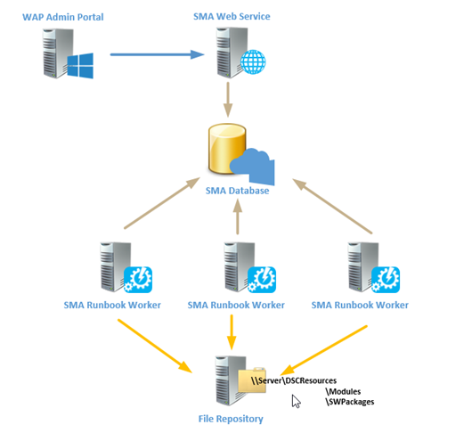

In this post I&#8217;m going to show how Powershell Desired State Configuration and Service Management Automation can be combined to ensure, all SMA Runbook Workers have the same configuration and set of additional Modules and SW packages installed.

I&#8217;m going through, step-by-step, so it&#8217;s easier to follow the intention of this joint venture between SMA and DSC.

If you&#8217;re not yet, but want to get into SMA and DSC I highly recommend to read my <a href="http://gallery.technet.microsoft.com/Service-Management-fcd75828/view/Reviews" target="_blank">SMA Whitepaper on Technet</a> as well as the TechNet documentation on <a href="http://blogs.technet.com/b/privatecloud/archive/2013/08/30/introducing-powershell-desired-state-configuration-dsc.aspx" target="_blank">Powershell DSC</a>.

So let&#8217;s start…

## The Use Case  

Having multiple Runbook workers we&#8217;re in charge to ensure, all workers have the same set of additional Powershell modules, and SW Packages such as management consoles for the various System Center products, installed and available. Because the Runbook workers are picking up jobs (runbooks) to execute randomly or on a current load base, we have to ensure, all workers are in sync from the configuration perspective. In most cases it is more comfortable to install required modules and management consoles on the SMA Runbook workers instead of remoting into each management host, using CMDLETs and modules with implicit remoting keeps the runbooks cleaner as well.

## The Solution (quick wrap)  

To achieve the goal we can leverage Powershell DSC which enables us to ensure that configurations like files and folders, SW packages, Registry Keys etc. exist in the way we need it or defined it for the target systems. The solution I&#8217;m gonna show here needs the following components.

  * A SMA Runbook which can be picked up by any active Runbook worker to execute the DSC Configurations
  * A SMA Variable (defined the SMA Web Service Endpoint)
  * A SMA Credential Object (used to push the DSC Configurations to all Runbook workers). The user must have administrative rights on all Runbook workers
  * A central repository (SMB Share) for SW packages, Powershell modules, files and folders. The Computer Accounts from all Runbook workers must have &#8220;Read and Execute&#8221; Permissions on the repository share

I&#8217;m currently using the push architecture of DSC, however I might change that in the future to a pull-server based architecture to be more scalable and compliant with security regulations for segregated environments.

## Scenario Overview  

 

I currently used the Package and the File resource from DSC. Both are built-in when you install WinRM 4.0.

Here is an example of a package definition:

<pre> #Ops Manager Console
            Package OpsMgrConsole
            {
                Name = "System Center Operations Manager 2012 Console"
                Path = "\\ssma01\DSCResources\SWPackages\OpsMgr\Setup.exe"
                ProductId = "041C3416-87CE-4B02-918E-6FDC95F241D3"
                Arguments = "/silent /install /components:OMConsole /EnableErrorReporting:Never /SendCEIPReports:0 /UseMicrosoftUpdate:1 /AcceptEndUserLicenseAgreement:1"
                Ensure = "Present"
                DependsOn = "[Package]MSReportViewer"
                ReturnCode = 0
            }</pre>

As you can see, this package resource will deploy an unattend installation of OpsMgr Console and has a dependency on the MS Report Viewer Package, which must be deployed first.

Here an example of a file resource I used to distribute additional standalone Powershell modules to my workers.

<pre>#Powershell Modules
            File PSModules 
            {
                SourcePath = $ModuleSourcePath
                DestinationPath = $ModulePath
                Recurse = $true
                Type = "Directory"
                CheckSum = "SHA-256"
                }
            }</pre>

But hey, how can I push the DSC configurations to all workers while one of them is going to execute the workflow himself when the runbook gets kicked off?

Here&#8217;s an extract of the runbook where you can see the magic.

<pre>  #Get all SMA Runbook Workers by invoking a request to SMA Web Service Endpoint
        $SMARunbookNodes = (Get-SmaRunbookWorkerDeployment -WebServiceEndpoint $USING:SMAWebServiceEndpoint -Credential $USING:psusercred).ComputerName
        Write-OutPut "INFO: Now creating DSC Configurations for SMA Runbook Servers: $SMARunbookNodes"

        #Create the DSC Mof files for each Worker
        UpdateRBConfig -NodeName $SMARunbookNodes -OutputPath $USING:DSCConfigPath

        #Run the DSC Configuration
        Write-OutPut "INFO: Deploying DSC Configuration"
        Start-DscConfiguration -Path $USING:DSCConfigPath -Force -wait -verbose
        Write-OutPut "INFO: DSC Configuration Finished, Check Job History for Details"</pre>

First I&#8217;m using a SMA Variable called $SMAWebServiceEndpoint where I defined the URI for SMA Web Service endpoint. Using the endpoint I&#8217;m gathering all Runbook worker deployments to get their host names. Invoking the DSC configuration information creates a .mof file for each of the workers.

So here&#8217;s the complete Runbook:

<pre>workflow Update-SMARunbookWorkers
{
    &lt;#
    Project Name: Update-SMARunbookWorkers 
    Runbook Name: Update-SMARunbookWorkers
    Runbook Type: Process 
    Runbook Tags: Type:Process, Proj:Update Runbook Workers, DSC 
    Runbook Description: Execute DSC Configurations on all Runbook Workers 
    Runbook Author: Michael Rüefli (www.miru.ch)
    Runbook Creation Date: 02/28/2014
    #&gt; 

    param(
        [Parameter(Mandatory=$true)]
        [SWITCH]$RebootWorkers
    )

    #Suspend Runbook on any error
    $ErrorActionPreference = "stop"

    #Get Defined Variables
    $SMAWebServiceEndpoint = Get-AutomationVariable -Name SMAWebServiceEndpoint

    #Get the Automation Credential 
    $PSUserCred = Get-AutomationPSCredential -Name SMAAdmin

    #Set the Output Path for local DSC Mof resources
    $DSCConfigPath = "C:\DSCConfigs\UpdateRBConfig"

    #We use an inline script for the DSC Configuration Part
    InlineScript
    {
        Configuration UpdateRBConfig 
        {
            param (
            [Parameter(Mandatory=$true)]
            [ValidateNotNullOrEmpty()]
            [String[]]$NodeName,

            [Parameter(Mandatory=$false)]
            [ValidateNotNullOrEmpty()]
            [String]$ModuleSourcePath = "\\ssma01\DSCResources\Modules",

            [Parameter(Mandatory=$false)]
            [ValidateNotNullOrEmpty()]
            [String]$ModulePath="$env:ProgramFiles\WindowsPowerShell\Modules"
            )

            Node $NodeName #we get the node names below by querying the SMA RB Worker Deployment
            {
                #Powershell Modules
                File PSModules 
                {
                    SourcePath = $ModuleSourcePath
                    DestinationPath = $ModulePath
                    Recurse = $true
                    Type = "Directory"
                    CheckSum = "SHA-256"
                }

                #SQL 2012 CLR Types
                Package SQL2K12CLRTypes
                {
                    Name = "Microsoft System CLR Types for SQL Server 2012 (x64)"
                    Path = "\\ssma01\DSCResources\SWPackages\SQLCLR2012\SQLSysClrTypes.msi"
                    ProductId = "F1949145-EB64-4DE7-9D81-E6D27937146C"
                    Ensure = "Present"
                    ReturnCode = 0
                }

                #Report Viewer 2010
                Package MSReportViewer
                {
                    Name = "Microsoft Report Viewer 2012 Runtime"
                    Path = "\\ssma01\DSCResources\SWPackages\ReportViewer\ReportViewer.msi"
                    ProductId = "421B88F8-D7C9-44CB-8B73-166D65B18DCC"
                    Ensure = "Present"
                    DependsOn = "[Package]SQL2K12CLRTypes"
                    ReturnCode = 0
                }

                #Ops Manager Console
                Package OpsMgrConsole
                {
                    Name = "System Center Operations Manager 2012 Console"
                    Path = "\\ssma01\DSCResources\SWPackages\OpsMgr\Setup.exe"
                    ProductId = "041C3416-87CE-4B02-918E-6FDC95F241D3"
                    Arguments = "/silent /install /components:OMConsole /EnableErrorReporting:Never /SendCEIPReports:0 /UseMicrosoftUpdate:1 /AcceptEndUserLicenseAgreement:1"
                    Ensure = "Present"
                    DependsOn = "[Package]MSReportViewer"
                    ReturnCode = 0
                }

                #SCVMM Console
                Package VMMConsole
                {
                    Name = "Microsoft System Center Virtual Machine Manager Administrator Console (x64)"
                    Path = "\\ssma01\DSCResources\SWPackages\SCVMM\setup.exe"
                    ProductId = "CDFB453F-5FA4-4884-B282-F46BDFC06051"
                    Arguments = "/client /i /IACCEPTSCEULA /f \\ssma01\DSCResources\SWPackages\SCVMM\VMClient.ini"
                    Ensure = "Present"
                    ReturnCode = 0
                }
            }
        }

        ## Let's do it....
        #Get all SMA Runbook Workers by invoking a request to SMA Web Service Endpoint
        $SMARunbookNodes = (Get-SmaRunbookWorkerDeployment -WebServiceEndpoint $USING:SMAWebServiceEndpoint -Credential $USING:psusercred).ComputerName
        Write-OutPut "INFO: Now creating DSC Configurations for SMA Runbook Servers: $SMARunbookNodes"

        #Create the DSC Mof files for each Worker
        UpdateRBConfig -NodeName $SMARunbookNodes -OutputPath $USING:DSCConfigPath

        #Run the DSC Configuration
        Write-OutPut "INFO: Deploying DSC Configuration"
        Start-DscConfiguration -Path $USING:DSCConfigPath -Force -wait -verbose
        Write-OutPut "INFO: DSC Configuration Finished, Check Job History for Details"

        #Reboot the Runbook workers if Parameter was set to True
        If ($Using:RebootWorkers)
        {
            Write-OutPut "INFO: Rebooting SMA Runbook Servers: $SMARunbookNodes"
            $SMARunbookNodes | Restart-Computer -force
        }
    }
    Write-OutPut "INFO: Runbooked finished successfully, Check Job History for Details"
}</pre>

## How to implement the solution

  1. Create a central accessible SMB share
  2. Make the share accessible to all your Runbook Worker Computer accounts
  3. Create a subfolder structure with two folder names Modules and SWPackages
  4. Place Modules and SW Binaries there accordingly (refer to paths defined in the runbook or adapt the paths there)
  5. Assign local admin permission to the Runbook  service account on all workers
  6. Open the WAP Admin Portal, switch to the Automation Pane and create a new Runbook called &#8220;Update-SMARunbookWorkers&#8221;
  7. Paste the whole runbook code above, save and publish it
  8. Create a SMA credential object called &#8220;SMAAdmin&#8221; (if choosing another name, adapt the runbook). This user has to be added as a SMA Portal Admin in the next step
  9. Using the SMA Powershell Module, add the principal used as SMAAdmin credential to the SMA Administrators 
    <pre>$connectionstring = 'Server=srvdb01.miru.local\SysCtr;Initial Catalog=Microsoft.MgmtSvc.Store;User ID=sa;Password=Some@Password'</pre>
    
    

      <pre id="crayon-5310acb364b29756772483-2">Add-MgmtSvcAdminUser -ConnectionString $connectionstring -Principal 'DOMAIN\SecurityGroupName'</pre>
    

 10. Create a SMA Variable named &#8220;SMAWebServiceEndpoint&#8221; and fill in the URL to your SMA Web Service endpoint (eg. &#8220;https://sma.yourdomain.com&#8221;)
 11. Optionally enable verbose logging for the runbook
 12. Execute it and have fun 🙂

If you&#8217;re familiar with the <a href="https://blogs.technet.com/b/privatecloud/archive/2013/10/23/automation-service-management-automation-sma-runbook-toolkit-spotlight-smart-for-runbook-import-and-export.aspx" target="_blank">SMART tool </a>you can also download the runbook from <a href="http://gallery.technet.microsoft.com/Using-DSC-to-keep-SMA-a0fce35f" target="_blank">TechNet here</a> and import it using SMART.

Note:  
The unattend command line syntax is valid for R2 versions of OpsMgr and VMM Console and may differ if you are using another version.

I usually keep DSC configurations separated from the logic, but to keep it a little bit simpler for this example I included the configuration within the SMA runbook.

&nbsp;

** Disclaimer**

THE SAMPLE CODE AND ANY RELATED INFORMATION ARE PROVIDED &#8220;AS IS&#8221; WITHOUT WARRANTY OF ANY KIND, EITHER EXPRESSED OR IMPLIED,  
INCLUDING BUT NOT LIMITED TO THE IMPLIED WARRANTIES OF MERCHANTABILITY AND/OR FITNESS FOR A PARTICULAR PURPOSE

&nbsp;