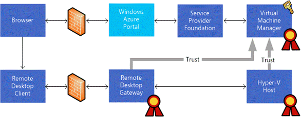
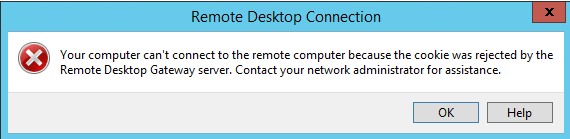
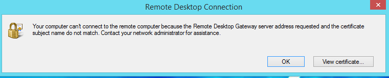

# What is WAP Console Connect?

WAP Remote Console Connect allows tenants to connect to their virtuals machine through a SSL-tunnelled RDP connection regardless of the virtual machine having an IP address or Remote Desktop connectivity enabled. The good thing here, it also works for Linux based VMs in the same way. The &#8220;bad&#8221; thing, the connection, even when RDP based, doesn&#8217;t allow client interactions like clip board, local drives, smart cards, etc. I&#8217;m not sure if this is be design for security reasons. However, when connecting via Internet, a dedicated Remote Desktop Gateway is required, as the RD Gateway gets a special &#8220;claim based authentication&#8221;-configuration making it unusable for other purposes like Remote Desktop Sessions or Remote Apps.  

<strong>This post&#8217;s intend is to highlight the most common mistakes when implementing Windows Azure Pack Console Connect feature</strong>.  I&#8217;m not going in detail through the installation and configuration procedure, as this is documented in <a href="http://technet.microsoft.com/en-us/library/dn469415.aspx" target="_blank">this TechNet Article</a>.  

To give you a basic understanding, I pasted the original Microsoft big picture here.  

   

Image: Remote Console Connect Architecture (Image Source: Microsoft)  

## How it works &#8220;in a nutshell&#8221;

While it is a bit more complex in detail, I tried to simplify the process for a short overview.

  * User connects to Tenant Portal and selects a virtual machine to connect to its remote console (not RDP)
  * Azure Pack connects via Service Provider Foundation to SCVMM and asks for an access token
  * SCVMM knows the Hyper-V Host, the VM is currently running on and creates a claim token using the private key of the installed VMM Gateway Certificate
  * The token together with a dynamic issued RDP file are returned to Azure Pack Tenant Portal and user is asked if he wants to open the signed RDP file
  * RDP Connection is established via RD Gateway to the Hyper-V Host, the VM currently runs on
  * The Hyper-V Host verifies the claim token using the public key of the VMM Gateway Certificate and grants access to the VM Remote Console

&nbsp;

## These are the basic requirements to get this thing up and running.

  * A valid SSL Certificate on SCVMM host with &#8220;Client Authentication&#8221; as enhanced key usage. If as self-signed certificate is used, it must also to be present on each Hyper-V Host (Local Machine Cert Store)
  * A valid SSL Certificate on the RD Gateway host with &#8220;Server Authentication&#8221; as enhanced key usage
  * Remote Console Connect configuration on SCVMM host
  * Federated Authentication Gateway component installed on the RD Gateway
  * Trusted certificate thumbprint set for RDP file signing on RD Gateway (the thumbprint of the certificate from Step 1)
  * RDP Client 8.1 on the endpoint. <a href="http://support.microsoft.com/kb/2830477/en-us" target="_blank">See here for a Windows 7 version of RDP 8.1 Client</a>

## Most common deployment mistakes

<strong>Mistake 1:  </strong>

  * A self-signed SSL certificate has been used on SCVMM to generate the access tokens, but the certificate has not been imported into the computers certificate store on each Hyper-V Host
  * A self-signed SSL certificate has been used on SCVMM to generate the access tokens, but the certificate&#8217;s public key has not been imported in the &#8220;Trusted Root Certificate Authorities&#8221; container on each Hyper-V Host  
    **In both cases above, Your browser will get a JSON file containing a not very helpful error message, instead of receiving an RDP File when trying to connect a VM Console  
** 

<strong>Mistake 2:  </strong>

  * The certificate has been issued with an invalid cryptographic service provider type -> &#8220;Microsoft Enhanced RSA and AES Cryptographic Provider&#8221; is required.

<strong>In this case the VMM Logs will display the following error:  </strong>

  SCVMM Version=3.2.7620.0  SCVMM flavor=C-buddy-RTL-AMD64  Default Assembly Version=3.2.7620.0  Executable Name=vmmservice.exe  Executable Version=3.2.7510.0  Base Exception Target Site=140727707248024  Base Exception Assembly name=mscorlib.dll  Base Exception Method Name=<strong>System.Security.Cryptography.CryptographicException.ThrowCryptographicException  </strong>Exception Message=<strong>Invalid algorithm specified</strong>.

<strong>Mistake 3:  </strong>

  * The thumbprint of the SSL certificate installed on SCVMM has not been registered on the RD Gateway host
  * The SSL Certificate for RD Gateway Host has been changed or renewed without restarting the host  
 

<strong>Mistake 4:  </strong>

  * The RD Gateway URL defined on the VM Cloud in WAP Portal does not match the CN of the RD Gateway Certficate.
  * The Certificate used for RD Gateway does not have DNS=<gatewayFQDN> set as a &#8220;Subject Alternative Name&#8221;
  * In this case you&#8217;ll see the following error message:  
 

While there are other pitfalls like SSL-Offloading, Load-Balancing etc., I hope this post covers the most often occurring issues and questions I see around Windows Azure Pack Console Connect feature. However, if you know other important pitfalls, feel free to ping me: <a href="http://www.twitter.com/DRMIRU" target="_blank">@DRMIRU</a>