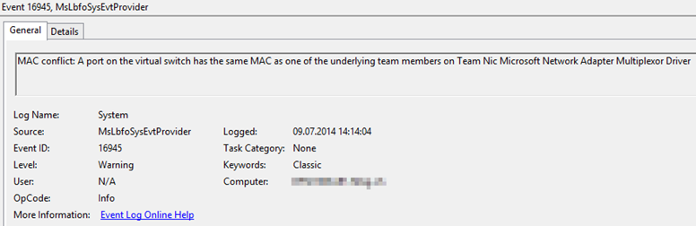
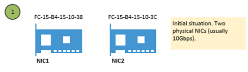
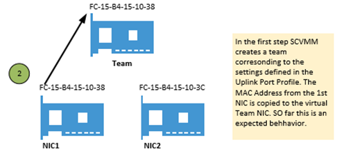
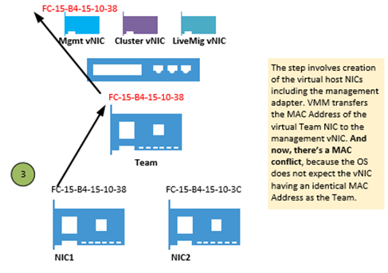

In this post I&#8217;m not going through the topic why you should use a software defined network architecture (SDN), there are plenty of posts out there explaining why THIS is the way to go. Instead I&#8217;ll explain how the teaming works in Server 2012 R2 and how it can hurt you while pushing a logical switch from SCVMM to your Hyper-V Cluster Nodes.

First it is important to understand the main concept behind a converged network setup. You can find a certain amount of links in [one of my recent posts here](http://www.miru.ch/hyper-v-scvmm-converged-fabric-nice-but-how-to/).

## Issue description

Pushing a logical switch including a virtual management adapter sometimes leads to issues with VMQ. Most of time VMQ issues are caused by bad drivers / firmware. We see a lot of issues with Emulex and Broadcom converged adapters at the moment. But sometimes it&#8217;s not only the driver&#8217;s fault that network communication brakes, or VMs lose their connectivity. Not fixing the following error can lead to complete outage of the Hyper-V hosts management network, depending on your physical switches and NIC drivers you&#8217;re using.

Let&#8217;s have a look under the hood how this stuff is working and why we see THIS annoying event 16945 from MsLbfoSys provider in the system event log of our Hyper-V hosts.

 

So here&#8217;s what&#8217;s happening when you deploy a logical switch with virtual Management OS NICs using SCVMM. BTW, there is no difference between the different available teaming modes (static, lacp or switch independent).  
The following process is the same for all methods.

 

&nbsp;

 

&nbsp;

 

IMHO, there&#8217;s absolutely no reason why SCVMM must clone the Team NICs MAC Address to the management vNIC. SCVMM itself has a Default MAC Address Pool, from where it assigns static and dynamic MAC addresses to host vNICs and Virtual Machine vNICs. So why it does not grant and assign a MAC address from the pool to the management vNIC?

&nbsp;

## The workaround

Here I&#8217;m jumping in with good old Powershell. After pushing the Logical Switch (either manually or during a baremetal deployment), I&#8217;m changing the MAC address of the management vNIC. Below you can find both, a regular PowerShell script as well as a SMA Runbook to achieve this. The Scripts are gathering the MAC Address Pool of VMM to grant an available MAC address to the host&#8217;s management vNIC. The MAC is then pushed to the management vNIC, meaning the existing duplicate is overwritten.

Be aware that changing the management vNIC&#8217;s MAC address will disrupt the management network communications for some seconds up to a minute, depending on how fast your physical network infrastructure populates the change down.

So here&#8217;s the whole magic in detail.

We get the MAC Pool from VMM

<pre>$macpool = Get-SCMACAddressPool "Default MAC address pool"</pre>

Then we need to get the host&#8217;s management vNIC

<pre>$VMHostNIC = Get-SCVirtualNetworkAdapter -VMHost "MyVMHostName" | ? {$_.PortClassification -match "Host management"}</pre>

We instruct VMM to assign a new MAC address from the pool to our management vNIC (note that this does not change the MAC on the host)

<pre>$NewMACAddress = (Grant-SCMACAddress -MACAddressPool $macpool -VirtualNetworkAdapter $VMHostNIC).Address</pre>

We execute the remote command against our Hyper-V host to change the MAC address

<pre>$AdapterName = $VMHostNIC.Name
Invoke-Command -ComputerName "MyVMHostName" -ScriptBlock {
       $MgmtNIC = Get-NetAdapter | where-object  {$_.Name -match $USING:AdapterName -and $_.InterfaceDescription -match 'Hyper-V Virtual Ethernet Adapter'}
       $MgmtNIC | Set-NetAdapter -MacAddress $USING:NewMACAddress -confirm:$false
}</pre>

And here&#8217;s the SMA Runbook version to automate it streamlined to a baremetal deployment.

<pre>Workflow Set-MgmtvNICMACAddress
{
    param(
    [Parameter(Mandatory=$true)]
    [STRING]$VMMServer,

    [Parameter(Mandatory=$true)]
    [STRING]$VMHostName,

    [Parameter(Mandatory=$false)]
    [STRING]$PortClassification="Host management",

    [Parameter(Mandatory=$false)]
    [STRING]$MACAddressPool="Default MAC address pool"
    )

    $HostMgmtCred = Get-AutomationPSCredential -Name "Host Access Account"
    $VMMMgmtCred = Get-AutomationPSCredential -Name "SCVMM Access Account"

    $NewNICInfo = InlineScript
    {
        $macpool = Get-SCMACAddressPool $USING:MACAddressPool
        $VMHostNIC = Get-SCVirtualNetworkAdapter -VMHost $USING:VMHostName | ? {$_.PortClassification -match "$USING:PortClassification"}
        $NewMACAddress = (Grant-SCMACAddress -MACAddressPool $macpool -VirtualNetworkAdapter $VMHostNIC).Address
        $NICInfo = New-Object -TypeName PSObject -Property @{
            "VMHostNICName" = $VMHostNIC.Name
            "NewMACAddress" = $NewMACAddress
        }
        $NICInfo
    } -PSComputerName $SCVMMServer -PSCredential $VMMMgmtCred

    InlineScript
    {
        $AdapterName = ($USING:NewNICInfo).VMHostNICName
        $NewMACAddress = ($USING:NewNICInfo).NewMACAddress
        $MgmtNIC = Get-NetAdapter | ? {$_.Name -match "$AdapterName" -and $_.InterfaceDescription -match 'Hyper-V Virtual Ethernet Adapter'}
        $MgmtNIC | Set-NetAdapter -MacAddress $NewMACAddress -confirm:$false
    } -PSComputerName $VMHostName -PSCredential $HostMgmtCred
}</pre>

## Other useful resources

Fellow <a href="https://twitter.com/DarrylvdPeijl" target="_blank">Darryl van der Peijl </a>has written a <a href="http://www.darrylvanderpeijl.nl/nic-teaming-modes-and-distribution-algorithms-in-windows-server-2012-r2/" target="_blank">nice post about the different teaming modes and traffic distribution algorythms</a>. -> A must read!

&nbsp;