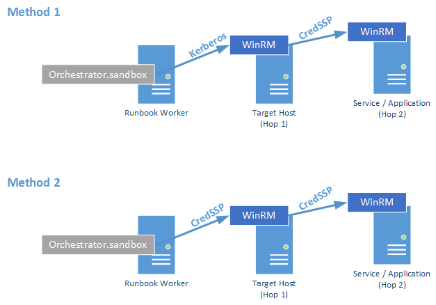

As SMA is almost anywhere around in my daily job, I&#8217;m also faced with usual and unusual troubles of course. Especially the authentication part can be a tricky one. Therefore I decided to dedicate the 3rd and last episode of the &#8220;Troubleshooting SMA&#8221; series to the &#8220;Authentication&#8221; topic.  
In this post I&#8217;m focusing on several considerations regarding authentication within SMA Runbooks. After a relatively dry theory block, I&#8217;ll pick up some scenarios from the field.

Find the first to blog post parts here&#8230;  
<a href="http://www.miru.ch/troubleshooting-sma-service-management-automation-part-2/" target="_blank">http://www.miru.ch/troubleshooting-sma-service-management-automation-part-2/</a>

<a href="http://www.miru.ch/troubleshooting-sma-service-management-automation-part-1/" target="_blank">http://www.miru.ch/troubleshooting-sma-service-management-automation-part-1/</a>

&nbsp;

## The starting point

  * Assuming that we all follow best practices, the Runbook Worker service account runs under a standard domain user account without extended privileges on remote systems.
  * We use SMA credential assets for connections to our target systems and platforms, if want it best, a dedicated credential with granular permissions per target system or system group
  * We install the least possible management tools and consoles on our Runbook Workers, to keep them clean and free from tools life cycle management

With this precedence, we use mostly WinRM (Powershell Remoting), either via implicit CMDLET remoting or plain WinRM sessions to the target systems. What does that mean? Well, from the point of view of a Runbook Worker , everything runs on a remote system.

## Different Authentication Methods

Either plain WinRM sessions as well as CMDLETs containing implicit remoting functionality have various options to authenticate us on the remote systems.

### Kerberos

This method is mostly used and can forward default as well as fresh credentials to the target systems. Kerberos uses so called &#8220;service tickets&#8221; to grant access to a remote system / service. Most CMDLETs which provide implicit remoting capabilities, use Kerberos.

### CredSSP

CredSSP has been introduced with Windows XP Sp3 and provides a mutual client/server authentication supporting the delegation of default or fresh credentials from a client to a target system / application. In our case the target service is WinRM on the target machine. **CredSSP is the currently the only method, which supports so called &#8220;double hop&#8221; scenarios with Powershell Remoting**.

### Certificate

This method uses a client/server authentication SSL certificate to authenticate on the remote system. It&#8217;s management is still relatively complex, as the thumbprint(s) have to be registered in the WinRM config manager. See <a href="http://blogs.msdn.com/b/wmi/archive/2009/03/23/how-to-use-wsman-config-provider-for-certificate-authentication.aspx" target="_blank">here</a> for more information on that.

### Negotiate

This is also known as &#8220;windows integrated&#8221; authentication and uses NTLM. However, more and more, only legacy applications support plain NTLM(v2) authentication, which is good IMHO, because it&#8217;s less secure than Kerberos. Negotiate does not work in double hop scenarios.

### Basic / Digest

This method is rarely used in untrusted or workgroup environments. It requires the remote hosts to be added as &#8220;trusted hosts&#8221; in the local WinRM config manager, and if we want to have a minimal level of security a SSL encrypted channel using a HTTPS URI to connect to the target.

&nbsp;

## The double hop scenario

Hopping from one machine to another using Powershell Remote Sessions is generally possible. However, the following restrictions currently apply.

  * Delegation of fresh credentials must be enabled on the source hop
  * CredSSP authentication must be enabled at least on the 2nd, 3rd, 4th hop etc..
  * Only works for domain joined / trusted environments

&nbsp;

The image illustrates a client, in our case the Runbook Worker creating a Powershell Remote Session to a target system using Default (Kerberos) authentication. From the target system we&#8217;d like to connect to a secondary system either using another WinRM command or to access a file share for example.

&#8211;> To make this working, depending on the method used above, we have to explicitly enable CredSSP credential delegation on HOP 1 and Hop 0 (for method 2). CredSSP authentication must be enabled on Hop 1 and Hop 2 (for method 2 on Hop 0 as well)

See <a href="http://msdn.microsoft.com/en-us/library/windows/desktop/ee309365(v=vs.85).aspx" target="_blank"><strong>here</strong></a> on how to enable it via CMDLETs or Group Policy.

We could also use plain Powershell or even DSC using the xCredSSP configuration resource from the DSC resource kit.

Here&#8217;s the Powershell way:

<pre>Enable-WSManCredSSP -Role Client -DelegateComputer *.contoso.com -Force</pre>

<pre>Enable-WSManCredSSP -Role Server -Force</pre>

## Some real life cases

### Accessing a file share

In this case I wanted to connect to a Hyper-V host and check, it the host has access to a file share. Furthermore I wanted to copy a file from the share down to the host.

**NON working example:**

<pre>Workflow test-shareaccess
{
 param(
 [string]$HyperVHostName,

 [string]$fileservername,

[string]$share
)

#Get the assets
$cred = Get-AutomationPSCredential -Name "Hyper-V ADM RunAs Account"

InlineScript {
 Get-Childitem "\\$USING:fileservername\$USING:share"
 klist #display our kerberos tickets 
 } -PSComputerName $HyperVHostName -PSCredential $cred
}</pre>

The above example will lead to an &#8220;UnauthorizedAccessException&#8221; because the WinRM Session does not forward our default credentials to the file server, and therefore we don&#8217;t get a kerberos service ticket for CIFS service on the file server.

With this small change, the example will work like charm

<pre>InlineScript {
 Get-Childitem "\\$USING:fileservername\$USING:share"
 klist #display our kerberos tickets 
 } -PSComputerName $HyperVHostName -PSCredential $cred <strong>-PSAuthentication CredSSP</strong>
}</pre>

The parameter -PSAuthentication is used within PS workflows for inline scripts to use CredSSP authentication. The explicit credential is then forwarded to the file server in this case above to get a service ticket for CIFS.

### DPM Remote Agent installation and configuration

I recently developed a couple of SMA runbooks to fully automate the Hyper-V host deployment using SCVMM and baremetal deployment with WDS. My goal was to keep the base image clean from additional SW and packages, so I decided to deploy the additional SW packages using DSC inside a runbook. This worked quite well, except when I wanted to execute the SetDPMServer.exe command to configure the host for it&#8217;s target DPM Server. The tool seems to perform a loop-back authentication and as I didn&#8217;t use the CredSSP method so far, the tool fails with an &#8220;permission denied&#8221; error too. I was confused because the credentials I used in the runbook had local admin permissions on the Hyper-V host. Using CredSSP solved this problem as well. And here is the complete example&#8230;

<pre>workflow Add-HostSWPackages
{
 param(
 [Parameter(Mandatory=$true)]
 [STRING]$VMHostName,
 [Parameter(Mandatory=$true)]
 [STRING]$VMHostGroup
 )
 $ErrorActionPreference="stop"
 #Get SCVMM Assets
 $HostManagementCred = Get-AutomationPSCredential -Name "CREDHostAccess"
 $SWshare = Get-AutomationVariable -Name "VARG-SWShare"
 $FabricDomainDN = Get-AutomationVariable -Name "VAR-DomainDN-Fabric"
 $VMHostDomain = $FabricDomainDN.Split(',').split('DC=')[3]
 Switch -CaseSensitive ($VMHostGroup)
 {
 "DC1" {$DPMServer = Get-AutomationVariable -Name "VARG-DPMServer-DC1"}
 "DC2" {$DPMServer = Get-AutomationVariable -Name "VARG-DPMServer-DC2"}
 }
 #Set the Output Path for local DSC Mof resources
 $DSCConfigPath = "C:\DSCConfigs\PAT000105\$VMHostName"
 #Remove all previous Mof files
 Try
 {
 Get-ChildItem -Path $DSCConfigPath -Filter "*.mof" | Remove-Item -Force
 }
 Catch {}
 #We use an inline script for the DSC Configuration Part
 InlineScript
 {
 $VerbosePreference = [System.Management.Automation.ActionPreference]$Using:VerbosePreference
 #Rescope Vars
 $DSCConfigPath = $USING:DSCConfigPath
 $VMHostName = $USING:VMHostName
 Configuration HyperVPackages 
 {
 param (
 [Parameter(Mandatory=$true)]
 [ValidateNotNullOrEmpty()]
 [String[]]$NodeName 
 )
 #Rescope the Vars
 $SWShare = $USING:SWshare
 $DPMServer = $USING:DPMServer
 $DPMAgentSrcPath = (Get-ChildItem -path "$SWshare\DPM\Agent" -Filter "DPMAgentInstaller_KB*AMD64.exe").FullName
 #Define DSC Configuration
 Node $NodeName
 {
 #Windows Features and Roles
 WindowsFeature ClusterPowershell 
 { 
 Ensure = "Present” 
 Name = "RSAT-Clustering-Powershell" 
 } 
 WindowsFeature HyperVPowershell 
 { 
 Ensure = "Present” 
 Name = "Hyper-V-Powershell" 
 } 
 #DPM Agent
 Package DPMAgent
 {
 Name = "Microsoft System Center 2012 R2 DPM Protection Agent"
 Path = "$DPMAgentSrcPath"
 ProductId = "6FA0CE18-E1AB-4CA2-B552-03D16516E174"
 Arguments = "/q /IAcceptEULA $DPMServer"
 Ensure = "Present"
 ReturnCode = 0
 }
 }
 } 
 Write-Verbose "Creating DSC MOFs in Path: $USING:DSCConfigPath"
 #Create the DSC Mof files for each Worker
 HyperVPackages -NodeName $USING:VMHostName -OutputPath "$DSCConfigPath\$VMHostName"
 #Run the DSC Configuration
 Write-Verbose "Deploying DSC Configuration"
 Start-DscConfiguration -Path "$DSCConfigPath\$VMHostName" -wait -Force -verbose -Credential $USING:HostManagementCred
 }
 #Configure DPMServer
 InlineScript
 {
 $VerbosePreference = [System.Management.Automation.ActionPreference]$Using:VerbosePreference
 Write-Verbose "Executing: .\SetDpmServer.exe -DPMServerName $USING:DPMServer"
 CD "C:\Program Files\Microsoft Data Protection Manager\DPM\bin"
 .\SetDpmServer.exe -DPMServerName $USING:DPMServer 
 } -PSComputer $VMHostName -PSAuthentication CredSSP -PSCredential $HostManagementCred 
 }</pre>

I hope this helps others to keep clear from the authentication &#8220;trial & error&#8221; hell a bit..