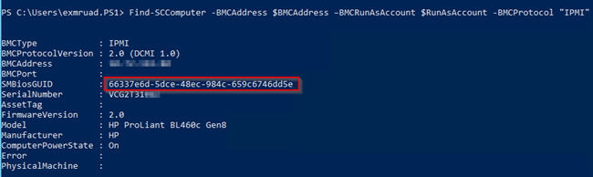
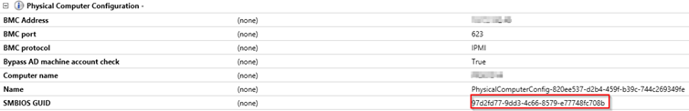

After recently updating a customer&#8217;s HP Blade environment to the current firmware release, Hyper-V baremetal deployment stopped working. The environment is managed via <a href="http://h17007.www1.hp.com/ch/de/enterprise/servers/products/infrastructure-management/index.aspx#.VP3wIE0mNps" target="_blank">HP OneView</a>. <a href="http://h17007.www1.hp.com/ch/de/enterprise/servers/products/infrastructure-management/index.aspx#.VP3wIE0mNps" target="_blank">HP OneView</a> is a linux based, virtual appliance for central management of HP components, such as servers, blade chassis, interconnect flex modules, etc. An important thing to know is that fact that the servers will get an additonal, virtual SMBIOSGUID, as soon as they get under control of <a href="http://h17007.www1.hp.com/ch/de/enterprise/servers/products/infrastructure-management/index.aspx#.VP3wIE0mNps" target="_blank">HP OneView</a>. And these are the issues I had, after the FW upgrade thru OneView.

  * **Issue 1**: TFTP Bootstrap / WDS <-> SCVMM authorization stops working. As a result, the automatic TFTP boot sequence aborts because no boot image is found/selected.
  * **Issue 2**: Host fails to register with SCVMM in WinPE mode

While issue 1 does not seem to be HW related (other fellow MVPs reported, that they have the same issue randomly), issue 2 seems to be related to current HP and DELL HW (might apply to others too). A troubleshooting session at these stages can be pain, but this time I had already an idea where to start my investigation. For some reason (still searching and digging why..) the HW does not always return the same SMBIOSGUID when triggered through the SCVMM CMDLETs. I&#8217;ve had similar issues in the past including the one <a href="http://www.hyper-v.nu/archives/hvredevoort/2011/11/how-to-bare-metal-deploy-a-hyper-v-server-via-vmm2012-and-hp-ilo/" target="_blank">here</a> well documented by fellow MVP Hans Vreedevort.

### Workaround for issue 1:

Adding the SCVMM boot image as a native boot image on the WDS host does not fix the automatic TFTP download, but enables you to issue a manual F12 boot from WDS to select the VMM boot image.

<pre>Import-WdsBootImage -NewImageName  "SCVMM Boot Image" -Path "D:\RemoteInstall\DCMgr\Boot\Windows\Images\Boot.wim"</pre>

&nbsp;

### Workaround for issue 2:

Issuing **Find-SCComputer** returned the following information from the ILO.

 

&nbsp;

When starting a new baremetal deployment task I could see why the deployment will fail to register with SCVMM during WinPE phase.

 

&nbsp;

The two SMBIOS IDs where different, that&#8217;s the reason for the failing registration with SCVMM during the WinPE phase. In fact, the second result returned the physical SMBIOSGUID while the first returned the virtual one genereated by HP OneView. The only workaround here I&#8217;m currently aware of is issuing a deep discovery before starting the baremetal deployment. Issuing a deep discovery via PowerShell requires the SMBIOSGUID to be submitted. As long as I submitted the virtual SMBIOSGUID, the stuff worked as expected. Because I&#8217;m doing all the tasks via SMA runbooks, including a few lines for the deep discovery was darn easy.

<pre>$RunAsAccount = Get-SCRunAsAccount -Name "HP ILO Admin"
$IPMIInfo = Find-SCComputer -BMCAddress $BMCAddress –BMCRunAsAccount $RunAsAccount -BMCProtocol "IPMI" -BMCPort 623
Find-SCComputer -BMCAddress $BMCAddress –BMCRunAsAccount $RunAsAccount -BMCProtocol "IPMI" -DeepDiscovery -SMBiosGuid $IPMIInfo.SMBiosGUID.Guid</pre>

&nbsp;

Hope this helps. As soon as I&#8217;ve found the root cause I&#8217;ll  update the post.