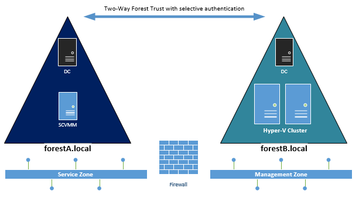
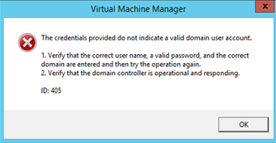
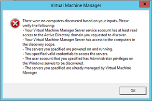

This is a &#8220;lessons learned&#8221; post and a follow up to an earlier post on &#8220;[SCVMM in multi-forest environments](http://www.miru.ch/scvmm-in-multi-forest-environments/)&#8221; to keep others away from &#8220;trial and error&#8221; when integrating SCVMM with Hyper-V in a secured environment. So what does &#8220;secured&#8221; and &#8220;locked down&#8221; mean in this context? Let me first describe the environment and use case a bit. The options to change the architecture below where limited due to customer&#8217;s internal security regulations.

So you might ask, why don&#8217;t you just enable &#8220;forest wide&#8221; authentication and why don&#8217;t you place VMM into the same network security zone as the Hyper-V hosts? Well humm.. just because I was not allowed to J. So I searched for documentation on this particular scenario **-> fail**.

Multi-forest in general is documented, but not the specific trust authentication mode. Additionally the [required ports for SCVMM documentation](https://technet.microsoft.com/en-us/library/gg710871.aspx) is not 100% complete. Enough said… let&#8217;s see how to get this thing up and running.  

### Environment

 

### 

&nbsp;

  * SCVMM in Forest A (Service Forest)
  * Hyper-V Nodes in Forest B (Fabric Forest)
  * Two-Way Trust with &#8220;selective authentication&#8221;
  * SCVMM and Hyper-V Hosts in different VLANs, segregated by Layer 7 Firewall

### Selective forest authentication in a nutshell

Enabling this option on the forest trust properties requires any user / group in the trusting forest to be granted explicitly on computer objects with the &#8220;allowed to authenticate&#8221; permission on the trusted forest.  
For detailed information on that see the following TechNet documentation: <https://technet.microsoft.com/en-us/library/cc755844%28v=ws.10%29.aspx>

### Issues to solve

  <table style="border-collapse: collapse;" border="0">
    <colgroup> <col style="width: 28px;" /> <col style="width: 356px;" /> <col style="width: 312px;" /></colgroup> <tr style="background: #00b0f0;">
      <td style="padding-left: 7px; padding-right: 7px; border: solid 0.5pt;">
        <strong> #</strong>
      </td>
      
      <td style="padding-left: 7px; padding-right: 7px; border-top: solid 0.5pt; border-left: none; border-bottom: solid 0.5pt; border-right: solid 0.5pt;">
        <strong>Issue</strong>
      </td>
      
      <td style="padding-left: 7px; padding-right: 7px; border-top: solid 0.5pt; border-left: none; border-bottom: solid 0.5pt; border-right: solid 0.5pt;">
        <strong>Solution</strong>
      </td>
    </tr>
    
    <tr>
      <td style="padding-left: 7px; padding-right: 7px; border-top: none; border-left: solid 0.5pt; border-bottom: solid 0.5pt; border-right: solid 0.5pt;">
        1
      </td>
      
      <td style="padding-left: 7px; padding-right: 7px; border-top: none; border-left: none; border-bottom: solid 0.5pt; border-right: solid 0.5pt;">
        Unable to verify RunAs credentials account for Host Management with error: ID 405  
 
        
        

          </td> 
          
          <td style="padding-left: 7px; padding-right: 7px; border-top: none; border-left: none; border-bottom: solid 0.5pt; border-right: solid 0.5pt;">
            Grant the RunAs account from Forest B &#8220;allowed to authenticate&#8221; permission on the SCVMM computer object in Forest A
          </td></tr> 
          
          <tr>
            <td style="padding-left: 7px; padding-right: 7px; border-top: none; border-left: solid 0.5pt; border-bottom: solid 0.5pt; border-right: solid 0.5pt;">
              2
            </td>
            
            <td style="padding-left: 7px; padding-right: 7px; border-top: none; border-left: none; border-bottom: solid 0.5pt; border-right: solid 0.5pt;">
              Unable to add Hyper-V Hosts and Clusters with error:  
 
              
              

                &nbsp;
              

              
              

                <em>Unable to connect via WMI. Hostname: hv001.forestA.local  Server &#8216;hv001.forestA.local&#8217; does not exist or access denied. Check firewall settings.  The RPC server is unavailable. (Exception from HRESULT: 0x800706BA)</em></td> 
                
                <td style="padding-left: 7px; padding-right: 7px; border-top: none; border-left: none; border-bottom: solid 0.5pt; border-right: solid 0.5pt;">
                  The TechNet documentation on &#8220;<a href="https://technet.microsoft.com/en-us/library/gg710871.aspx">required ports for SCVMM</a>&#8221; does mention the following ports for SCVMM Agent installation:  
 
                  
                  

                    TCP 445  
                  

                  
                  

                    TCP 135  
                  

                  
                  

                    TCP 139  
                  

                  
                  

                    TCP 80  
                  

                  
                  

                    &nbsp;
                  

                  
                  

                    Assuming that no firewall admin in the world will allow RPC dynamic ports >1024 from SCVMM to all Hyper-V nodes. we have <a href="https://support.microsoft.com/en-us/kb/154596">to fix the RPC port range</a>. In this example I used: 51000-51500, and request the firewall rule accordingly  
                  

                  
                  

                    &nbsp;
                  

                  
                  

                    <strong>Note! The endpoint mapper (tcp 135) and the RPC port range must also be opened to any CNO (Cluster named Object) resp. to it&#8217;s IP address  </strong></td> </tr> 
                    
                    <tr>
                      <td style="padding-left: 7px; padding-right: 7px; border-top: none; border-left: solid 0.5pt; border-bottom: solid 0.5pt; border-right: solid 0.5pt;">
                        3
                      </td>
                      
                      <td style="padding-left: 7px; padding-right: 7px; border-top: none; border-left: none; border-bottom: solid 0.5pt; border-right: solid 0.5pt;">
                        Unable to add Hyper-V Hosts and Clusters with error:  
 
                        
                        

                          </td> 
                          
                          <td style="padding-left: 7px; padding-right: 7px; border-top: none; border-left: none; border-bottom: solid 0.5pt; border-right: solid 0.5pt;">
                            <ul>
                              <li>
                                Grant the SCVMM Service account from Forest A &#8220;allowed to authenticate&#8221; permission on all Hyper-V hosts in Forest B  
                              </li>
                              <li>
                                Grant the SCVMM Service account from Forest A &#8220;read&#8221; permission in Forest B  
                              </li>
                              <li>
                                Allow LDAP/LDAPs connection from SCVMM in Forest A to all Domain Controllers in  Forest B  
                              </li>
                              <li>
                                Ensure the selected RunAs Account has local Administrator permissions on all Hyper-V hosts  
                              </li>
                              <li>
                                Ensure name resolution works between both forests
                              </li>
                            </ul>
                          </td></tr> 
                          
                          <tr>
                            <td style="padding-left: 7px; padding-right: 7px; border-top: none; border-left: solid 0.5pt; border-bottom: solid 0.5pt; border-right: solid 0.5pt;">
                              4
                            </td>
                            
                            <td style="padding-left: 7px; padding-right: 7px; border-top: none; border-left: none; border-bottom: solid 0.5pt; border-right: solid 0.5pt;">
                              Cluster Service suddenly stops on certain nodes after some days of operation. Trying to restart the service results in error:  
 
                              
                              

                                <em>RPC Endpoint mapper / no endpoint available</em></td> 
                                
                                <td style="padding-left: 7px; padding-right: 7px; border-top: none; border-left: none; border-bottom: solid 0.5pt; border-right: solid 0.5pt;">
                                  Increase the RPC port range to a minimum of 200 ports. Cluster-intercommunication also requires RPC ports. Depending on other management tasks and interfaces the documented minimum range of 100 ports can become too small.
                                </td></tr> </tbody> </table> 
 
                                
                                

                                  &nbsp;
                                

                                
                                <h3>
                                  In short you need to…
                                </h3>
                                
                                <ul>
                                  <li>
                                    Configure all Hyper-V Hosts to use a fixed range for RPC Ports starting somewhere from > 5000 (depending on the existing ports in the firewall ruleset)
                                  </li>
                                  <li>
                                    Configure the firewall ruleset accordingly
                                  </li>
                                  <li>
                                    Grant the Host Management RunAs account from Forest B &#8220;allowed to authenticate&#8221; permission on the SCVMM computer object in Forest A
                                  </li>
                                  <li>
                                    Grant the SCVMM Service account from Forest A &#8220;allowed to authenticate&#8221; permission on all Hyper-V hosts and CNOs in Forest B
                                  </li>
                                  <li>
                                    Grant the SCVMM Service account from Forest A &#8220;read&#8221; permission in Forest B
                                  </li>
                                  <li>
                                    Allow LDAP/LDAPs connection from SCVMM in Forest A to all Domain Controllers in  Forest B
                                  </li>
                                  <li>
                                    Ensure the selected Host Management RunAs Account has local Administrator permissions on all Hyper-V hosts
                                  </li>
                                  <li>
                                    Ensure name resolution works between both forests
                                  </li>
                                </ul>
                                
                                

                                  &nbsp;
                                

                                
                                

                                  Hope this helps and saves some nerves…. Mine are gone for today 😉
                                

                                
                                

                                  &nbsp;
                                
