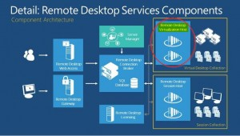

Microsoft based VDI deployments require to install a specific Windows Feature called &#8220;RDS-Virtualization&#8221; onto all Hyper-V hosts being part of a RDS VDI Deployment.

After adding a Hyper-V host to an existing RDS VDI deployment, the host gets registered with a unique ID and it&#8217;s hostname within the broker database. The corresponding tables are rds.Server and rds.Rdvh.  Another important piece is the VmHostAgent service on the Hyper-V host, configured with certain parameters corresponding the deployment like the broker machines, VDI Desktop collections. The responsible key is:

HKEY\_LOCAL\_MACHINE\SYSTEM\CurrentControlSet\Services\VmHostAgent

If you have to re-deploy / stage such a Hyper-V host, the RDS VDI deployment does not know anything about the host anymore, as the host does not have the required assignment within its VmHostAgent configuration. Of course you could start to tweak the registry of the host, restarting several services to fix this issue. I&#8217;ve created a SMA runbook which does the work in a, let&#8217;s say, more &#8220;proper&#8221; way. It can be used to just add a fresh Hyper-V host to an existing deployment or to &#8220;re-add&#8221; a re-staged host. If the parameter -RemoveExistingHost is specified It removes the existing host from the deployment using the RDS PowerShell CMDLETs. If the removal fails, the host is cleared from the database using a native TSQL statement. Afterwards, the host is re-added to the deployment using the native RDS CMDLETs again.

You can find the source code on <a href="https://gallery.technet.microsoft.com/scriptcenter/SMA-Runbook-to-fix-RDS-53c61973" target="_blank">TechNet</a>

Hope this helps,

Feel free to comment if you have found a better way to fix this issue.

&nbsp;

&nbsp;

&nbsp;

&nbsp;