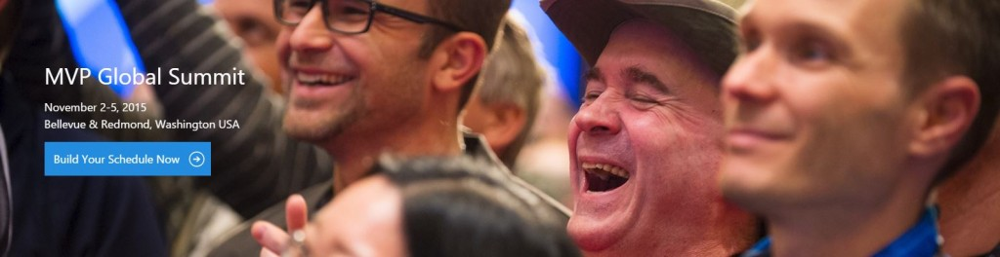
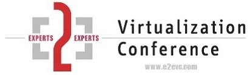

As last year, November 2015 will be a very busy month. Beside lot of customer projects all around private- and hybrid Cloud deployments, first stop on my road trip is Seattle. During the week of 1_st_ to 06_th_ of October I&#8217;m honored to join the annual MVP Summit in Redmond.

For those who don&#8217;t know what I&#8217;m talking about, the global <a href="https://mvp.microsoft.com/en-US/Summit" target="_blank">MVP Summit</a> is a week full of deep dive material, sessions and personal meetings with Microsoft Product Groups Leads and Program Managers. The session schedule looks awesome and I&#8217;m really looking forward to get the latest and greatest insights on future product releases as well as deep dive feedback discussions on current releases with the product teams and my fellow MVPs from all over the world. The whole PG organization as well as the MVP leads are putting a huge amount of effort into this event, which is IMHO a &#8220;give back&#8221; to us MVPs, spending lots of our spare time to dig into issues and real world deployments and sharing them with the community.

After coming back from WA and hopefully overcoming the beloved jet lag, I will move to Lisbon, joining and speaking at the E2E Virtualization Conference. This time again with my co-worker and fellow MVP <a href="https://twitter.com/ThomasMaurer" target="_blank">Thomas Maurer</a>. <a href="https://twitter.com/JohnerStefan" target="_blank">Stefan Johner</a>, SME for SCSM and <a href="https://twitter.com/stefanroth_net" target="_blank">Stefan Roth</a>, CDM MVP will also join and speak, so fun is programmed 🙂

&nbsp;

&nbsp;

&nbsp;

&nbsp;

&nbsp;

<a href="http://www.e2evc.com/home" target="_blank">E2EVC</a> is a community event for experts around the virtualization-, cloud- and enduser-computing space. <a href="http://www.miru.ch/why-im-consistently-returning-to-e2e-virtualization-conference/" target="_blank">Read more here</a>, why you might want to join this conference, just in case you haven&#8217;t so yet 😉

Right after coming back from Lisbon, I will move to the Netherlands (Ede), where <a href="http://www.expertslive.nl" target="_blank">Experts Live</a>, Benelux&#8217;s largest community event will take place. Again I&#8217;m honored to speak there about Automation in hybrid Cloud environments. In fact the session is called: <a href="http://www.expertslive.nl/2015/09/19/become-an-automation-ninja-in-60-minutes-en-michael-rueefli-mvp/" target="_blank">Become an Automation Ninja in 60 Minutes </a>🙂

<a href="http://www.expertslive.nl" target="_blank">  </a>

&nbsp;

&nbsp;

&nbsp;

Experts Live is organized by <a href="http://www.inovativ.nl/" target="_blank">Inovativ</a>, a dutch company based in the Netherlands and Belgium. Lot of my fellow MVPs work there 😉

&nbsp;

Hope to see you at one of the events!

cheers!

Michael

&nbsp;