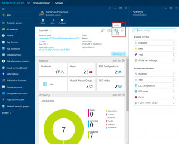
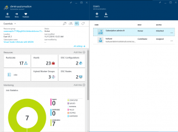

Since December 24th, Azure Automation supports RBAC. We really asked Microsoft to implement this enhancement, as lots of sensitive information and code may live within an Azure Automation account. Assets are used to store credentials, variables, connection objects. As you might have more and more contributors to the system, you probably don&#8217;t want to share all your credential objects to anyone writing automation runbooks. Before RBAC, the only way was to create multiple Automation accounts, but of course this introduced other difficulties.  

Now, here&#8217;s where you access the RBAC component.  

   

   

We have 5 different roles, to which we can assign users.   <em>  </em>

  <table style="border-collapse: collapse;" border="0">
    <colgroup> <col style="width: 172px;" /> <col style="width: 200px;" /> <col style="width: 2px;" /> <col style="width: 141px;" /> <col style="width: 98px;" /> <col style="width: 0px;" /></colgroup> <tr style="height: 2px; background: #00b0f0;">
      <td style="border-top: solid 0.5pt; border-left: solid 0.5pt; border-right: solid 0.5pt; padding: 1px 7px 1px 7px;" rowspan="2" valign="middle">
        Role
      </td>
      
      <td style="border-top: solid 0.5pt; border-left: none; border-bottom: solid 0.5pt; border-right: none; padding: 1px 7px 1px 7px;" valign="middle">
        Permissions
      </td>
      
      <td style="border-top: solid 0.5pt; border-left: none; border-bottom: solid 0.5pt; padding: 1px;" colspan="4">
      </td>
    </tr>
    
    <tr style="height: 18px;">
      <td style="border-top: none; border-left: none; border-bottom: solid 0.5pt; border-right: solid 0.5pt; padding: 1px 7px 1px 7px;" valign="middle">
         Runbooks
      </td>
      
      <td style="border-top: none; border-left: none; border-bottom: solid 0.5pt; border-right: none; padding: 1px;">
      </td>
      
      <td style="border-top: none; border-left: none; border-bottom: solid 0.5pt; border-right: solid 0.5pt; padding: 1px 7px 1px 7px;" valign="middle">
        Resources
      </td>
      
      <td style="border-top: none; border-left: none; border-bottom: solid 0.5pt; border-right: solid 0.5pt; padding: 1px 7px 1px 7px;" valign="middle">
        Roles / Access
      </td>
    </tr>
    
    <tr style="height: 18px;">
      <td style="border-top: none; border-left: solid 0.5pt; border-bottom: solid 0.5pt; border-right: solid 0.5pt; padding: 1px 7px 1px 7px;" valign="middle">
        Owner
      </td>
      
      <td style="border-top: none; border-left: none; border-bottom: solid 0.5pt; border-right: solid 0.5pt; padding: 1px 7px 1px 7px;" valign="middle">
         Edit
      </td>
      
      <td style="border-top: none; border-left: none; border-bottom: solid 0.5pt; border-right: none; padding: 1px;">
      </td>
      
      <td style="border-top: none; border-left: none; border-bottom: solid 0.5pt; border-right: solid 0.5pt; padding: 1px 7px 1px 7px;" valign="middle">
        Edit
      </td>
      
      <td style="border-top: none; border-left: none; border-bottom: solid 0.5pt; border-right: solid 0.5pt; padding: 1px 7px 1px 7px;" valign="middle">
        Edit
      </td>
    </tr>
    
    <tr style="height: 18px;">
      <td style="border-top: none; border-left: solid 0.5pt; border-bottom: solid 0.5pt; border-right: solid 0.5pt; padding: 1px 7px 1px 7px;" valign="middle">
        Contributor
      </td>
      
      <td style="border-top: none; border-left: none; border-bottom: solid 0.5pt; border-right: solid 0.5pt; padding: 1px 7px 1px 7px;" valign="middle">
         Edit
      </td>
      
      <td style="border-top: none; border-left: none; border-bottom: solid 0.5pt; border-right: none; padding: 1px;">
      </td>
      
      <td style="border-top: none; border-left: none; border-bottom: solid 0.5pt; border-right: solid 0.5pt; padding: 1px 7px 1px 7px;" valign="middle">
        Use within Runbooks
      </td>
      
      <td style="border-top: none; border-left: none; border-bottom: solid 0.5pt; border-right: solid 0.5pt; padding: 1px 7px 1px 7px;" valign="middle">
        &#8212;
      </td>
    </tr>
    
    <tr style="height: 18px;">
      <td style="border-top: none; border-left: solid 0.5pt; border-bottom: solid 0.5pt; border-right: solid 0.5pt; padding: 1px 7px 1px 7px;" valign="middle">
        Reader
      </td>
      
      <td style="border-top: none; border-left: none; border-bottom: solid 0.5pt; border-right: solid 0.5pt; padding: 1px 7px 1px 7px;" valign="middle">
         Read
      </td>
      
      <td style="border-top: none; border-left: none; border-bottom: solid 0.5pt; border-right: none; padding: 1px;">
      </td>
      
      <td style="border-top: none; border-left: none; border-bottom: solid 0.5pt; border-right: solid 0.5pt; padding: 1px 7px 1px 7px;" valign="middle">
         Read
      </td>
      
      <td style="border-top: none; border-left: none; border-bottom: solid 0.5pt; border-right: solid 0.5pt; padding: 1px 7px 1px 7px;" valign="middle">
         Read
      </td>
    </tr>
    
    <tr style="height: 18px;">
      <td style="border-top: none; border-left: solid 0.5pt; border-bottom: solid 0.5pt; border-right: solid 0.5pt; padding: 1px 7px 1px 7px;" valign="middle">
        Automation Operator
      </td>
      
      <td style="border-top: none; border-left: none; border-bottom: solid 0.5pt; border-right: solid 0.5pt; padding: 1px 7px 1px 7px;" valign="middle">
         start / stop /suspend / resume
      </td>
      
      <td style="border-top: none; border-left: none; border-bottom: solid 0.5pt; border-right: none; padding: 1px;">
      </td>
      
      <td style="border-top: none; border-left: none; border-bottom: solid 0.5pt; border-right: solid 0.5pt; padding: 1px 7px 1px 7px;" valign="middle">
         &#8212;
      </td>
      
      <td style="border-top: none; border-left: none; border-bottom: solid 0.5pt; border-right: solid 0.5pt; padding: 1px 7px 1px 7px;" valign="middle">
         &#8212;
      </td>
    </tr>
    
    <tr style="height: 18px;">
      <td style="border-top: none; border-left: solid 0.5pt; border-bottom: solid 0.5pt; border-right: solid 0.5pt; padding: 1px 7px 1px 7px;" valign="middle">
        User Access Administrator
      </td>
      
      <td style="border-top: none; border-left: none; border-bottom: solid 0.5pt; border-right: solid 0.5pt; padding: 1px 7px 1px 7px;" valign="middle">
        &#8212;
      </td>
      
      <td style="border-top: none; border-left: none; border-bottom: solid 0.5pt; border-right: none; padding: 1px;">
      </td>
      
      <td style="border-top: none; border-left: none; border-bottom: solid 0.5pt; border-right: solid 0.5pt; padding: 1px 7px 1px 7px;" valign="middle">
        &#8212;
      </td>
      
      <td style="border-top: none; border-left: none; border-bottom: solid 0.5pt; border-right: solid 0.5pt; padding: 1px 7px 1px 7px;" valign="middle">
        Edit
      </td>
    </tr>
  </table>

Key component behind the scenes is of course ARM (<a href="https://azure.microsoft.com/en-us/documentation/articles/resource-group-overview/">Azure Resource Manager</a>).  

Although you can&#8217;t define different access levels on single objects, you have the possibility to delegate Asset-Management to a security department, while still be able to have more Runbook authors contributing to your automation solutions.  

  