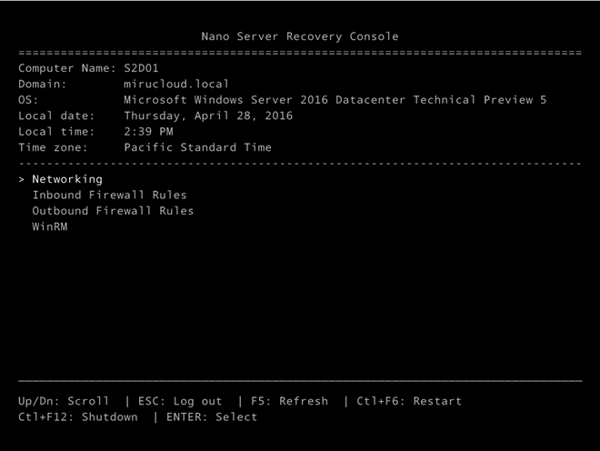

Yesterday Microsoft made [Windows Server 2016 TP5](https://www.microsoft.com/en-us/evalcenter/evaluate-windows-server-technical-preview?wt.mc_id=WW_CE_OMS_OO_BLOG_NONE) public available. With it, Nano Server also comes in a new version and the two flavors. <span style="font-size: 12pt;"><br /> </span>

  * WIM Image being part of the ISO Media
  * Native VHD Disk Image

For those still new to Nano Server, it will be the new flagship for server types such as (not mentioning as final a list),

  * Hyper-V Compute Nodes
  * Storage Nodes (Storage Spaces and Storage Spaces Direct)
  * Web Servers
  * Containers Hosts
  * DNS Servers

Nano Server not only has a very low footprint (~ 700MB for a Hyper-V-, or Storage-Failover-Cluster Node), it also minimizes the attack surface, required reboots and maximizes the overall performance for its specific roles, which it is deployed for. To get more information on Nano Server in general I&#8217;ve included a few resources here: Nano Server Blog: <https://blogs.technet.microsoft.com/nanoserver> Getting Started with Nano Server: <https://technet.microsoft.com/en-us/library/mt126167.aspx>

### What&#8217;s next?

It&#8217;s pretty clear at this stage, that Tp5 will be the last technical preview before RTM. This means basically that the product is now feature-complete. Microsoft is targeting RTM for fall 2016. Now, what&#8217;s new to TP5 of Nano Server? Just to focus on some important things here…

## Enhancements to Nano Server TP5

### Emergency Console

Nano Server is being managed remotely, and only remotely. There is no more RDP to a Nano Server or a local console, nor a min-GUI option. IMHO this is a right move, so people aren&#8217;t messing up with configurations and custom installation on a productive fabric / datacenter hosts. The less GUIs, the less changes are being made to a Windows Server, it&#8217;s just that fact. There are basically two option to manage your Nano Servers.

  * PowerShell Remoting (WinRM)
  * <div>
      <a href="https://blogs.technet.microsoft.com/nanoserver/2016/02/09/introducing-server-management-tools/">Server Management Tools</a>
    </div>
    
    &nbsp;</li> </ul> 
    
    However, if things go wrong and you have accidently to use the console, the EC (Emergency Console) might be your friend. Microsoft really heard our feedback loud and clear and enhanced the EC features in TP5. These are…
    
      * TCP/IP v4/v6 Settings can now be changed using the EC
      * Windows Firewall rules can now be changed EC
      * WinRM can be turned on/off using the EC
    
 
    
    ### Additional Feature/Role Packages
    
      * DCB (Data Center Bridging)
      * Secure Boot
      * Shielded VMs
      * PowerShell DSC
    
    ### Deployment
    
    The PowerShell Script to create new Nano Server images has been slightly changed which makes it at the end even simpler to create new base images for your Nano Server within a few minutes. Here&#8217;s a working example with the TP5 version, in this case for a Storage Node.
    
    `<span style="color: #00b0f0; font-family: Consolas; font-size: 9pt;">Import-Module </span>``<span style="color: #00b0f0; font-family: Consolas; font-size: 9pt;">G:\NanoServer\NanoServerImageGenerator\NanoServerImageGenerator.psm1 -verbose</span>`  
    `<span style="color: #00b0f0; font-family: Consolas; font-size: 9pt;">$Adminpw = ConvertTo-SecureString -String 'SomePassw0rd!' -AsPlainText -Force<br />
</span>``<span style="color: #00b0f0; font-family: Consolas; font-size: 9pt;">$NodeName = "S2DNode1"<br />
</span>```<span style="color: #00b0f0; font-family: Consolas; font-size: 9pt;">New-NanoServerImage -MediaPath G:\ -BasePath "E:\NanoServerTemp\$NodeName" -TargetPath "E:\LocalVMs\$NodeName\$NodeName.vhd" -Storage -Clustering -EnableRemoteManagementPort `<br />
</span>```<span style="color: #00b0f0; font-family: Consolas;"><span style="font-size: 9pt;">-ComputerName "$NodeName" -AdministratorPassword $adminpw -DeploymentType Host -Edition Datacenter -DomainName cloudnext.poc -ReuseDomainNode </span> </span>`
    
    <span style="font-family: Times New Roman; font-size: 12pt;"> Stay tuned for more Nano stuff to come…</span>