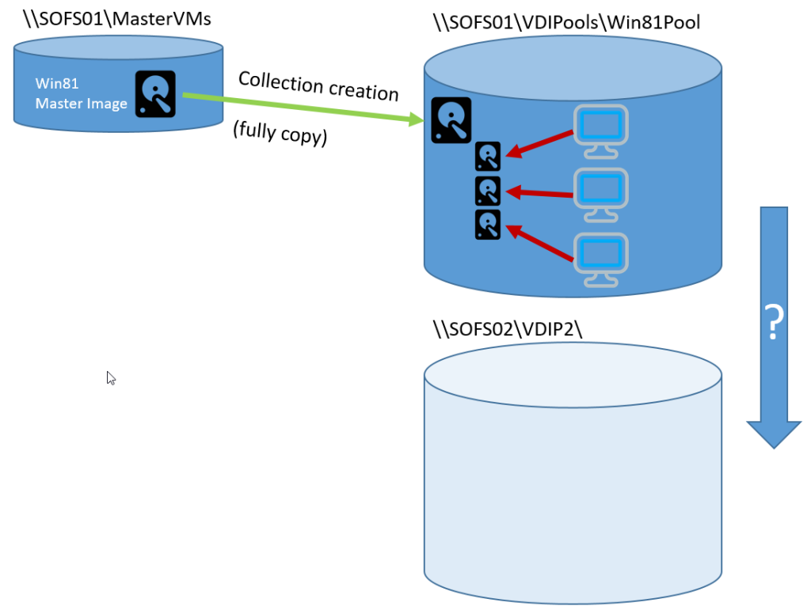

The time will come, where you have to &#8220;re-home&#8221; your RDS VDI collections, respectively the master images and the deployed desktop instances to a new storage location. In this post I&#8217;ll guide through the steps which worked for me. _**As they involve direct modifications to the RDS Database, this is probably not officially supported and you&#8217;ll do it on your own risk!**_

### Microsoft RDS VDI Deployments

Microsoft RDS VDI Deployments are available in two flavours.

  * Personal (persistent) Desktops
  * Pooled (non-persistent) Desktops

While personal Desktop collections are stateful and based on a full copy of the golden image for each desktop, Pooled Desktop collections use differencial disks and VM checkpoints. Pooled desktops are reset, when the user logs off to the state of the master image.

No matter which model you choose, when creating a new Desktop Collection, the master image gets copied to the destination volume or SMB share selected for the new collection. From there every new desktop provisioned is either again a full  clone or a so called &#8220;linked clone&#8221; with a differencing disk based on a checkpoint reflecting the original VM state after cloning from the master.

Unfortunately, there isn&#8217;t a PowerShell CMDLET or any GUI based method to relocate an existing pool and it&#8217;s provisioned desktops to a different storage location.

### Steps for moving a collections storage location

  * Provision a new CSV or SMB Share
  * Grant full control to &#8220;everyone&#8221; if it&#8217;s a SMB Share on share-level
  * Grant full control to RDS Connection Broker Security Group on NTFS -level
  * Grant full control to any Hyper-V Host being part of the deployment as a RDS Virtualization Host
  * Grant full control to yourself or your Admin group
  * Copy directory structure (without files) from existing to new location <pre class="">robocopy \\SOFS01\vdi01\Win8Pool \\SOFS02\vdi02\Win8Pool /e /xf *</pre>

  * Copy the IMGS folder to the new location (recursive) <pre class="">robocopy \\SOFS01\vdi01\Win8Pool\PersonalPool_Win81\IMGS \\SOFS02\vdi02\Win8Pool\PersonalPool_Win81\IMGS /e</pre>

  * Export all Desktops being part of the collection <pre class="">$VDIDesktops = Get-RDVirtualDesktop -CollectionName PersonalPool_Win81 -ConnectionBroker RDCB01.contoso.com</pre>

  * Live Migrate VM Storage for all desktops in this collection

<pre class="crayon-selected">Foreach ($VD in $VDIDesktops) 
{
  Move-VMStorage –VMName $VD.VirtualDesktopName -ComputerName $VD.HostName -DestinationStoragePath "\\SOFS02\vdi02\Win8Pool\PersonalPool_Win81\$($VD.VirtualDesktopName)"
}</pre>

&nbsp;

  * Change the storage location reference for the copied master image (collection base image)

<pre class="">Select Name,ValueStr FROM rds.PoolProperty
Where Name = 'PROV_Vm_BaseVmLocation'
AND ValueStr = '\\SOFS01\VDI01\Win8Pool\PersonalPool\IMGS\__1'</pre>

<pre class="">Update rds.PoolProperty SET ValueStr = '\\SOFS02\vdi02\Win8Pool\PersonalPool\IMGS\__1'
Where Name = 'PROV_Vm_BaseVmLocation'
AND ValueStr = '\\SOFS01\VDI01\Win8Pool\PersonalPool\IMGS\__1'</pre>

  * Change storage location path for the desktops in RDS database

<pre class="">Update rds.VmProvisioning SET SMBSharePath = '\\SOFS02\vdi02\Win8Pool'
WHERE SMBSharePath =  '\\SOFS01\vdi01\Win8Pool'</pre>

  * If it is a pooled collection, you need to update the following entry as well

<pre class="">Update rds.VmProvisioning SET LocalPathforGoldVM = '\\SOFS02\vdi02\Win8Pool'
WHERE LocalPathforGoldVM = '\\SOFS01\vdi01\Win8Pool'
</pre>

  Now it&#8217;s time to test if the users still can connect to the desktops and if you can provision additional desktops to the collection. If you completed the required steps above you should be fine.

  Hope this helps..

