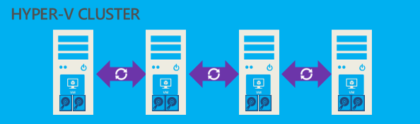

In this article I&#8217;m going through the steps required to build up a S2D hyper-converged cluster using virtual machines. S2D BTW stands for &#8220;Storage Spaces Direct&#8221;, which is has been introduced with Server 2016.

As a general disclaimer:

  * The setup is for Lab / Test purposes only, do not consider to use it in production
  * The guide is valid for Server 2016 Technical Preview 5. Some of the steps described might change with RTM version

I like the concept of Nano Server very much, so I try to always test new Server 2016 features on Nano Server first, because this will be the new default deployment for fabric servers like Hyper-V nodes, Scale out File Server Nodes, or Storage Spaces Direct nodes.

### Overview

&nbsp;

### Requirements

  * A physical computer with Server 2016 TP5 installed
  * CPU with SLAT (second level address translation) support (required for nested virtualization)
  * 32GB Memory
  * Local Disks / Remote SMB Storage (SSD is recommended)

### Creating Nano Server Images and VMs

So the first step is to create new nano server images for our 4-node S2D Cluster. I&#8217;m using the New-NanoServerImage CMDLET for this purpose. Also, the machine, from where I execute the CMDLET is domain joined, so I don&#8217;t need to manually create the domain join blob file.

<pre class="">$ServerNodes = @("S2D01","S2D02","S2D03","S2D04")
cd E:\NanoServer
Import-Module E:\NanoServer\NanoServerImageGenerator.psm1 -verbose
$Adminpw = ConvertTo-SecureString -String 'someSecurePassw0rd' -AsPlainText -Force</pre>

<pre class="">#Create Nano Nodes
$Packages = @(
"Microsoft-NanoServer-Guest-Package",
"Microsoft-NanoServer-FailoverCluster-Package",
"Microsoft-NanoServer-Storage-Package",
"Microsoft-NanoServer-Compute-Package",
"Microsoft-NanoServer-SCVMM-Compute-Package")</pre>

<pre class="">$ServerNodes | % {
 
 #Create Nano Server Image
 New-NanoServerImage -MediaPath C:\Source\Server2016TP5 -BasePath "E:\NanoServerTemp\$_" -TargetPath "E:\LocalVMs\$_\$_.vhd" -Packages $packages -ComputerName "$_" -AdministratorPassword $adminpw -DeploymentType Host -Edition Datacenter -DomainName mirucloud.local -ReuseDomainNode
 
 #Create new VM with Nano Image as base disk
 New-VM -Name $_ -MemoryStartupBytes 4096MB -BootDevice IDE -VHDPath "E:\LocalVMs\$_\$_.vhd" -SwitchName $vSwitchName -Path "E:\LocalVMs\$_" -Generation 1
 Set-VM -Name $_ -ProcessorCount 2
 
 #Enable nested virtualization
 Set-VMProcessor -VMName $_ -ExposeVirtualizationExtensions $true

 #Add network Interfaces
 Add-VMNetworkAdapter -VMName $_ -SwitchName $vSwitchName -DeviceNaming On
 
 #Enable MAC Spoofing
 Get-VMNetworkAdapter -VMName $_ | Set-VMNetworkAdapter -MacAddressSpoofing On

 #Start VM
 Start-VM -Name $_ 
 
 #Remove temp files
 Remove-Item "E:\NanoServerTemp\$_" -Force -recurse
}</pre>

&nbsp;

### Create virtual disks for each node

We can simulate SSDs and HDDs by placing the VHDX files respectively on local SSD or HDD drives. (note: additional steps required later to set the media type)

<pre class="">#Create virtual disks
Foreach ($s in $ServerNodes)
{
 New-VHD -Path "E:\LocalVMs\$s\ssd1.vhdx" -SizeBytes 400GB -Dynamic
 New-VHD -Path "E:\LocalVMs\$s\ssd2.vhdx" -SizeBytes 400GB -Dynamic
 New-VHD -Path "F:\LocalVMs\$s\HDD1.vhdx" -SizeBytes 1200GB -Dynamic
 New-VHD -Path "F:\LocalVMs\$s\HDD2.vhdx" -SizeBytes 1200GB -Dynamic
 New-VHD -Path "F:\LocalVMs\$s\HDD3.vhdx" -SizeBytes 1200GB -Dynamic
 New-VHD -Path "F:\LocalVMs\$s\HDD4.vhdx" -SizeBytes 1200GB -Dynamic
}</pre>

<pre class="">#Attach Disks
Foreach ($s in $ServerNodes)
{
 Add-VMHardDiskDrive -VMName $s -Path "E:\LocalVMs\$s\ssd1.vhdx" -ControllerType SCSI
 Add-VMHardDiskDrive -VMName $s -Path "E:\LocalVMs\$s\ssd2.vhdx" -ControllerType SCSI
 Add-VMHardDiskDrive -VMName $s -Path "F:\LocalVMs\$s\HDD1.vhdx" -ControllerType SCSI
 Add-VMHardDiskDrive -VMName $s -Path "F:\LocalVMs\$s\HDD2.vhdx" -ControllerType SCSI
 Add-VMHardDiskDrive -VMName $s -Path "F:\LocalVMs\$s\HDD3.vhdx" -ControllerType SCSI
 Add-VMHardDiskDrive -VMName $s -Path "F:\LocalVMs\$s\HDD4.vhdx" -ControllerType SCSI
}</pre>

### Create the vSwitch on all Nodes and create the Cluster

<pre class="">#Create vSwitch
Foreach ($s in $ServerNodes)
{
 New-VMSwitch -CimSession $s -NetAdapterName "Ethernet 2" -Name "vSwitch"
}

#Create Cluster
New-Cluster -Name S2DCL01 -Node $ServerNodes -NoStorage

#Set Cloud Witness (could also be a FSW)
Set-ClusterQuorum -Cluster S2DCL01 -CloudWitness -AccountName "&lt;storage account name&gt;" -AccessKey "&lt;Access Key&gt;"
</pre>

### Enable Storage Spaces Direct

We enable it here, to see all local disks from all nodes, because for virtual lab we have to create the Storage Pool manually.

<pre class="">#Enable Storage Spaces Direct
Enable-ClusterStorageSpacesDirect -Autoconfig $false -SkipEligibilityChecks -CimSession $ServerNodes[0] -Confirm:$false</pre>

### Create Storage Pool

This would be automatically done by Enable-ClusterStorageSpacesDirect . But as we have virtual disks, we have to manually create the pool first and set (override) the &#8220;physical&#8221; disk media type property

<pre class="">#Create the Storage Pool
$pooldisks = Get-PhysicalDisk -CimSession $ServerNodes[0] | ? canpool
New-StoragePool -CimSession $ServerNodes[0] -StorageSubSystemFriendlyName "*Cluster*" -FriendlyName "S2D Pool" -FaultDomainAwarenessDefault StorageScaleUnit -PhysicalDisks $pooldisks

#Set the mediatype
Get-StoragePool S2D* -CimSession $ServerNodes[0] | Get-PhysicalDisk | where {$_.Size -lt 500GB} | Set-PhysicalDisk -MediaType SSD
Get-StoragePool S2D* -CimSession $ServerNodes[0] | Get-PhysicalDisk | where {$_.Size -gt 1TB} | Set-PhysicalDisk -MediaType HDD

#Set SSD Disks as Journal Disks for Cache
Get-StoragePool S2D* -CimSession $ServerNodes[0] | Get-PhysicalDisk | where {$_.Size -lt 500GB} | Set-PhysicalDisk -Usage Journal</pre>

### Set (fake) Media Types and create Storage Tiers

<pre class="">#Set the mediatype
Get-StoragePool S2D* -CimSession $ServerNodes[0] | Get-PhysicalDisk | where {$_.Size -lt 500GB} | Set-PhysicalDisk -MediaType SSD
Get-StoragePool S2D* -CimSession $ServerNodes[0] | Get-PhysicalDisk | where {$_.Size -gt 1TB} | Set-PhysicalDisk -MediaType HDD

#Create Storage Tiers
New-StorageTier -CimSession $ServerNodes[0] -StoragePoolFriendlyName S2D* -FriendlyName Capacity -MediaType HDD
New-StorageTier -CimSession $ServerNodes[0] -StoragePoolFriendlyName S2D* -FriendlyName Performance -MediaType SSD</pre>

### Create Volumes

It&#8217;s a best practice to create one volume per node as a minimum, to have optimal load distribution

<pre class="">#Create Volumes
New-Volume -CimSession $ServerNodes[0] -StoragePoolFriendlyName S2D* -FriendlyName vdisk1 -FileSystem CSVFS_REFS -StorageTierFriendlyName Capacity -StorageTierSizes 250GB
New-Volume -CimSession $ServerNodes[1] -StoragePoolFriendlyName S2D* -FriendlyName vdisk2 -FileSystem CSVFS_REFS -StorageTierFriendlyName Capacity -StorageTierSizes 250GB
New-Volume -CimSession $ServerNodes[2] -StoragePoolFriendlyName S2D* -FriendlyName vdisk3 -FileSystem CSVFS_REFS -StorageTierFriendlyName Capacity -StorageTierSizes 250GB
New-Volume -CimSession $ServerNodes[3] -StoragePoolFriendlyName S2D* -FriendlyName vdisk4 -FileSystem CSVFS_REFS -StorageTierFriendlyName Capacity -StorageTierSizes 250GB

#Rename Volume friendly names and mount points accordingly
$csv = get-clustersharedvolume -Cluster S2DCL02
Foreach ($vol in $CSV)
{
 If ($vol.SharedVolumeInfo.FriendlyVolumeName -match 'Volume\d+$')
 {
 If ($vol.Name -match '\((.*)\)')
 {
 $MatchStr1 = $matches[1]
 $mountpoint = ($vol.SharedVolumeInfo.FriendlyVolumeName) -replace 'C:','C$'
 $vol.Name = $MatchStr1
 $OwnerNode = ($vol.OwnerNode).Name
 Rename-Item -Path "\\$OwnerNode\$mountpoint" -NewName $MatchStr1  
 }
 }
}
#distribute Volumes across nodes
Get-ClusterSharedVolume -Cluster S2DCL01 *vdisk1* | Move-ClusterSharedVolume -Node S2D01
Get-ClusterSharedVolume -Cluster S2DCL01 *vdisk2* | Move-ClusterSharedVolume -Node S2D02
Get-ClusterSharedVolume -Cluster S2DCL01 *vdisk3* | Move-ClusterSharedVolume -Node S2D03
Get-ClusterSharedVolume -Cluster S2DCL01 *vdisk4* | Move-ClusterSharedVolume -Node S2D04</pre>

Now, you should hav2 a 4-Node Storage Spaces Direct (hyper-converged) Cluster running on virtual machines ready to go 🙂

You can find the whole script on TechNet <a href="https://gallery.technet.microsoft.com/Building-Storage-Spaces-a0436d4e" target="_blank">here</a>.

Any feedback is welcome of course!

Cheers!

&nbsp;