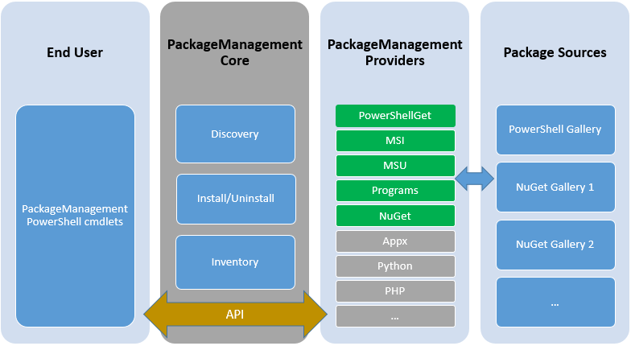

Nano Server is a new deployment option for Server 2016 where you need to create the images prior the deployment. If you&#8217;re unfamiliar with Nano Server I highly recommend the following &#8220;[getting started](https://technet.microsoft.com/en-us/library/mt126167.aspx#BKMK_online)&#8221; documentation.

After deployment you might want to service your deployed images, like adding more packages or install servicing packges (updates / rollup packs).

Nano Server supports the following methods to add the items above.

  * PowerShell Package Provider
  * Windows Server Update Services

### Adding Packages to an existing Nano Server deployed image

To add packages you can leverage PowerShell PackageManagement, formerly known as OneGet capabilities.

PackageManagement is essentially a Package Management Aggregator.  
It creates a unified and consistent PowerShell interface for users and provides a plug-in model at the back end that different  
installer technologies or package managers can plug-in as providers, using PackageManagement APIs.  
Each provider further manages one or multiple package sources (repositories) where software packages are stored.

  

    

      

        <article id="post-43" class="post-43 post type-post status-publish format-standard hentry category-uncategorized tag-packagemanagement"> 
        
        

          

            
          

        
</article>
      

    

  

&nbsp;

In this example we are going to deploy the DSC package, post image deployment, to ensure DSC capabilities for next step.

This little sample script installs the NanoServerPackage provider, downloads and installes the DSC Package.

<pre class="">#Install Nano Server Package Provider and DSC Package on all Nodes
$Nodes = @('S2D01.mirucloud.local','S2D02.mirucloud.local','S2D03.mirucloud.local','S2D04.mirucloud.local')
$Nodes | foreach {
 Invoke-Command -ComputerName $_ -ScriptBlock {
 Install-PackageProvider NanoServerPackage -Force
 Import-PackageProvider NanoServerPackage
 Install-package Microsoft-NanoServer-DSC-Package -ProviderName NanoServerPackage -Force
 }
}</pre>

&nbsp;

### Installing Windows Server Updates

#### Deploy Windows Update Client Settings

Nano Server does not support GPOs at all, so to get Windows Updates, you have to distribute Update Client registry  settings using PowerShell, or even better, using PowerShell DSC. The next example is a DSC configuration to deploy required registry settings for Windows Update Client to pull updates from an internal WSUS.

<pre class="">$ConfigurationData = 
@{
 AllNodes = 
 @(
 @{
 NodeName = '*'
 WSUSServer = 'http://vmmtp5.mirucloud.local:8530'
 WSUSTargetGroup = 'StorageNodes'
 },

 @{
 NodeName = 'somenode'
 }

);
 NonNodeData = ''
}

Configuration WSUSAutodownload
{
 param(
 [Parameter(mandatory=$true)]
 [string[]]$NodeName
 )
 
 Node $NodeName
 {
 Registry UpdateServer
 {
 Key = 'HKLM:\Software\Policies\Microsoft\Windows\WindowsUpdate' 
 ValueName = 'WUServer'
 ValueData = 'http://fppw0010.adm.swissic.ch:8530'
 ValueType = 'String'
 Ensure = 'Present'
 }

Registry StatusServer
 {
 Key = 'HKLM:\Software\Policies\Microsoft\Windows\WindowsUpdate' 
 ValueName = 'WUStatusServer'
 ValueData = 'http://vmmtp5.mirucloud.local:8530'
 ValueType = 'String'
 Ensure = 'Present'
 }

Registry UpdateTargetGroup
 {
 Key = 'HKLM:\Software\Policies\Microsoft\Windows\WindowsUpdate' 
 ValueName = 'TargetGroup'
 ValueData = 'StorageNodes'
 ValueType = 'String'
 Ensure = 'Present'
 }

Registry TargetMode
 {
 Key = 'HKLM:\Software\Policies\Microsoft\Windows\WindowsUpdate' 
 ValueName = 'TargetGroupEnabled'
 ValueData = 1
 ValueType = 'DWord'
 Ensure = 'Present'
 }
 
 Registry InstallOption
 {
 Key = 'HKLM:\Software\Policies\Microsoft\Windows\WindowsUpdate\AU' 
 ValueName = 'AUOptions'
 ValueData = 3 #(2 = Notify before download. 3 = Automatically download and notify of installation. 4 = Automatic download and scheduled installation. (Only valid if values exist for ScheduledInstallDay and ScheduledInstallTime.) 5 = Automatic Updates is required, but end users can configure it.)
 ValueType = 'DWord'
 Ensure = 'Present'
 }
 
 Registry DetectionFrequencyHours
 {
 Key = 'HKLM:\Software\Policies\Microsoft\Windows\WindowsUpdate\AU' 
 ValueName = 'DetectionFrequencyEnabled'
 ValueData = 2 # (hours frequency)
 ValueType = 'DWord'
 Ensure = 'Present'
 } 
 
 Registry Installday
 {
 Key = 'HKLM:\Software\Policies\Microsoft\Windows\WindowsUpdate\AU' 
 ValueName = 'ScheduledInstallDay'
 ValueData = 6 # 0-7 (where 0 is every day, 1 is Sunday)
 ValueType = 'DWord'
 Ensure = 'Present'
 } 
 }
}</pre>

<pre class="">$Nodes = @('S2D01.mirucloud.local','S2D02.mirucloud.local','S2D03.mirucloud.local','S2D04.mirucloud.local')</pre>

<pre class="">#Create Configuration
WSUSAutodownload -ConfigurationData $ConfigurationData -OutputPath C:\DSC\WSUS -NodeName $Nodes

#Push Config
Start-DscConfiguration -Path C:\DSC\WSUS -Wait -Force -Verbose

</pre>

Whit this set, your Nano Servers will get the required setting to pull and download updates from WSUS. But, wait, there&#8217;s one more thing.

How to invoke a Windows Update Client update cycle?

Again, of yourse, PowerShell. Here&#8217;s the recipe for this, a little PS Script to invoke an update run to install all required updates. Optionally you can force a reboot cycle.

<pre class="">param(
[Parameter(mandatory=$true)]
[string]$ServerName,

[Parameter(mandatory=$false)]
[switch]$InstallRequired,

[Parameter(mandatory=$false)]
[switch]$ForceReboot
)

#Search Updates
$sess = New-CimInstance -Namespace root/Microsoft/Windows/WindowsUpdate -ClassName MSFT_WUOperationsSession -CimSession $ServerName
$scanResults = Invoke-CimMethod -InputObject $sess -MethodName ScanForUpdates -Arguments @{SearchCriteria="IsInstalled=0";OnlineScan=$true}

#display available Updates
$scanResults.Updates | Select Title,KBArticleID

#Install Updates
If ($InstallRequired)
{
 If (($scanResults.Updates).count -gt 0)
 {
 
 Write-Output "Installing Updates"
 $scanResults = Invoke-CimMethod -InputObject $sess -MethodName ApplyApplicableUpdates

If ($ForceReboot)
 {
 Write-Output "Restarting Node $ServerName"
 Invoke-Command -ComputerName $ServerName -ScriptBlock {Restart-Computer -Force}
 }
 }
 Else
 {
 Write-Warning "No applicaple Updates found"
 }
}</pre>

I really enjoy Nano Server and it&#8217;s concepts. So with this post I hope this helps and you&#8217;ll love it as well, more and more 😉

Stay tuned for more coming up&#8230;