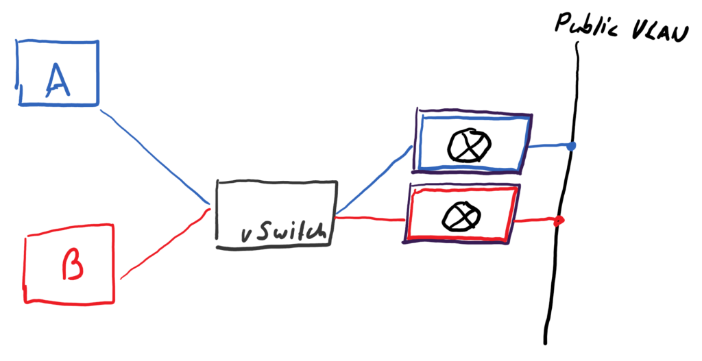
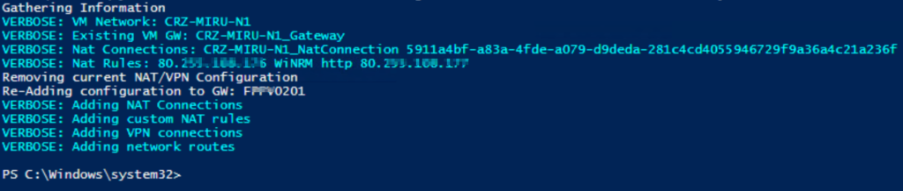

At some point in time every SDN deployment hits it&#8217;s scale limit. In Microsofts SDNv1, a single NVGRE gateway can serve up to 100 tenant virtual networks and 200-300Mbit/s throughput. To scale out the network virtualization deployment, additional gateways or gateway clusters have to be deployed. But how can we migrate existing virtualized tenant VM networks from one gateway to another?

  * There are a couple of steps are required to make this happen
  * Remove NAT Rules
  * Remove VPN Connection definitions and routed subnets
  * Remove NAT connections
  * Re-Add all of the above on the new gateway

I&#8217;ve created a little, which does that all automatically. All NAT connections and Rules (including multiple public IP addresses) and VPN settings are transfered to the new GRE gateway device.

You can find the code on [my github repository](https://github.com/drmiru/Powershell/blob/master/SCVMM/Move-VMNetVirtualizationConfig.ps1)

As a short disclaimer here:

You are using the script at your very own risk. I don&#8217;t take any responsibility for messed up HNV deployments. 🙂