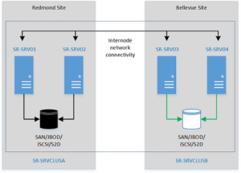

Extending Cluster Shared Volumes is a common task which is required from time to time. Although my favorite action is to create a new volume if existing ones lack in free space, sometimes there&#8217;s no way around extending an existing volume. I&#8217;m really happy Microsoft did listen on our feedback we provided on Storage Replica, in the early stages of Server 2016 TP version, where we yelled for the feature (online-extending a replicated volume).

By default, online extension of replicated volumes is disabled. It&#8217;s a &#8220;per Replication Group&#8221; setting which has to be enabled via PowerShell.

In the following example, we&#8217;re going to extend a volume, based on a virtual disk of a S2D (Storage Spaces Direct) cluster, which has some volumes replicated to another S2D Cluster using the Cluster-to-Cluster SR scenario.

&nbsp;

&nbsp;

&nbsp;

&nbsp;

&nbsp;

&nbsp;

&nbsp;

&nbsp;

**To enable volume resize, the feature has to be activated on the affected source Replication Group**

<pre class="">Set-SRGroup -ComputerName S2DCL01 -Name 'SourceRG01' -AllowVolumeResize $true</pre>

**Next, we extend the virtual disk on the source cluster as well as on the destination cluster**

<pre class="">Get-VirtualDisk -FriendlyName vdisk1 -CimSession S2DCL01 | Resize-VirtualDisk -Size 400GB

Get-VirtualDisk -FriendlyName vdisk1 -CimSession S2DCL02 | Resize-VirtualDisk -Size 400GB</pre>

!We have to make sure, that both of the virtual disks have exactly the same size.

If the virtual disks are &#8220;multiresilient&#8221; disks, the resize command is as follows:

<pre class="">Get-VirtualDisk -FriendlyName vdisk1 -CimSession S2DCL01 | Get-StorageTier | ? ResiliencySettingName -eq 'Performance' | Resize-StorageTier -Size 100GB</pre>

<pre class="">Get-VirtualDisk -FriendlyName vdisk1 -CimSession S2DCL01 | Get-StorageTier | ? ResiliencySettingName -eq 'Capacity' | Resize-StorageTier -Size 800GB</pre>

**Get the supported max size of the source volume partition**

<pre class="">$Partition = Get-VirtualDisk -FriendlyName vdisk1 -CimSession S2DCL01 | Get-Disk | Get-Partition | ? {$_.Type -eq 'Basic'}

$MaxSize = ($Partition | Get-PartitionSupportedSize).SizeMax</pre>

&nbsp;

**Resize the volume partition on the source**

<pre class="">$Partition | Resize-Partition -Size $MaxSize</pre>

### A few side notes

  * The destination volume / partition doesn&#8217;t have to be resized, as the change gets replicated on the destination volume
  * After the extend process it&#8217;s highly recommended to disable volume resizing again, just because of the fact some administrator might extend a volume without knowing, that it is part of a SR-Partnership. <pre class="">Set-SRGroup -ComputerName S2DCL01 -Name 'SourceRG01' -AllowVolumeResize $false</pre>

  * The above example uses WinRM from a management server, hence the steps also work for Nano Server
  * SR CMDLETs have to be installed on the management server: <pre class="">Add-WindowsFeature RSAT-Storage-Replica</pre>

  * If volume resizing is not enabled, you can extend the virtual disk, but as soon as you want to extend the CSV partition, you&#8217;ll receive the following CIM exception:  
    Resize-Partition : Failed  
    Activity ID: {a5fa44ea-d115-4cb8-b535-f7c3fdab14cd}  
    At line:1 char:76  
    + &#8230; ession S2DCL01 | Get-Partition) | Resize-Partition -Size 377822859264  
    + ~~~~~~~~~~~~~~~~~~~~~~~~~~~~~~~~~~~  
     + CategoryInfo : NotSpecified: (StorageWMI:ROOT/Microsoft/&#8230;/MSFT_Partition) [Resize-Partition], CimExce  
     ption  
     + FullyQualifiedErrorId : StorageWMI 4,Resize-Partition  
     + PSComputerName : S2DCL01

Hope this prevents some headaches.