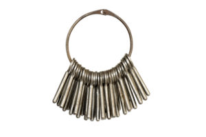

On March 7th, Microsoft made SSE (Storage  Service Encryption) using your own keys GA (generally available).

This is greate news, as now everyone can create own managed keys to encrypt Azure Storage Accounts.  Azure Storage Accounts can be enabled with encryption at rest for quite a while, but till now, Microsoft owned the keys for the encryption.

SSE uses Azure Key Vault behind the scenes, a highly available and scalable secure storage for RSA cryptographic keys backed by either a Software Storage or FIPS 140-2 Level 2 validated Hardware Security Modules (HSMs).

&nbsp;

&nbsp;

&nbsp;

&nbsp;

For more information on Azure KeyVault see here: <https://docs.microsoft.com/en-us/azure/key-vault/key-vault-whatis>

&nbsp;

&nbsp;

In the following example, I&#8217;ll show how to enable SSE on an Azure Storage Account using a fresh generates RSA Key with Azure PowerShell CMDLETs.

<pre class="">#Some parameters
$storageAccountName = 'lrswe01'
$keyvaultName = 'mirukv01'
$keyName = "storagekey$storageAccountName"
$rgName = 'RGWE'

#Assign SA Identity
Set-AzureRmStorageAccount -ResourceGroupName $rgName -Name $storageAccountName -AssignIdentity

#Enable Soft delete on KeyVault
($resource = Get-AzureRmResource -ResourceId (Get-AzureRmKeyVault -VaultName $keyvaultName).ResourceId).Properties | Add-Member -MemberType NoteProperty -Name enableSoftDelete -Value 'True'
Set-AzureRmResource -resourceid $resource.ResourceId -Properties $resource.Properties -Force
($resource = Get-AzureRmResource -ResourceId (Get-AzureRmKeyVault -VaultName $keyvaultName).ResourceId).Properties | Add-Member -MemberType NoteProperty -Name enablePurgeProtection -Value 'True'
Set-AzureRmResource -resourceid $resource.ResourceId -Properties $resource.Properties -Force

#Create a new RSA Key and store in KeyVault
$KeyOperations = 'encrypt','decrypt','wrapKey','unwrapKey'
$Expires = (Get-Date).AddYears(2).ToUniversalTime()
$NotBefore = (Get-Date).ToUniversalTime()
$Tags = @{'Sesitivity' = 'high'; 'owner' = 'drmiru'}
Add-AzureKeyVaultKey -VaultName $keyvaultName -Name $keyName -Expires $Expires -NotBefore $NotBefore -KeyOps $KeyOperations -Tag $Tags -Destination Software

#Enable SSE on Storage Account
$storageAccount = Get-AzureRmStorageAccount -ResourceGroupName $rgName -AccountName $storageAccountName
$keyVault = Get-AzureRmKeyVault -VaultName $keyvaultName
$key = Get-AzureKeyVaultKey -VaultName $keyVault.VaultName -Name $keyName
Set-AzureRmKeyVaultAccessPolicy -VaultName $keyVault.VaultName -ObjectId $storageAccount.Identity.PrincipalId -PermissionsToKeys wrapkey,unwrapkey,get
Set-AzureRmStorageAccount -ResourceGroupName $storageAccount.ResourceGroupName -AccountName $storageAccount.StorageAccountName -EnableEncryptionService "Blob" -KeyvaultEncryption -KeyName $key.Name -KeyVersion $key.Version -KeyVaultUri $keyVault.VaultUri</pre>

For demo purposes I used &#8220;Software&#8221; for the destination of the RSA key. For production environments I highly recommend to use a premium SKU of KeyVault and store the key on a HSM. To do this, the only thing is to substitute the value of parameter -Destination with the value &#8220;HSM&#8221;.

**Stay secure and encrypt your storage accounts, data is yours.**

&nbsp;