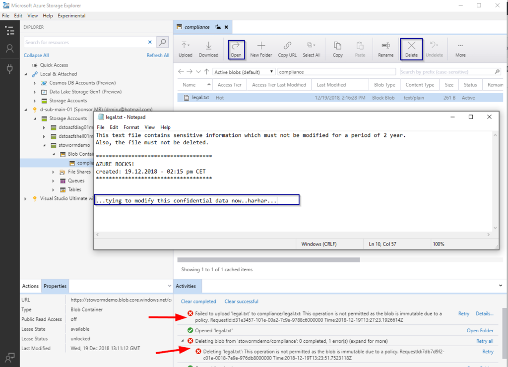

## Intro

In a previous post I covered Azure Storage DLM (policy based data lifecycle management) to leverage automatic storage tiering and archival. In this post I&#8217;m going to show how immutable compliant WORM storage can be enabled and used on Azure Blob Storage.

## WORM &#8211; not a tiny, slimy animal

WORM stands for &#8220;Write-Once-Read-Many&#8221; or in other terms for compliant, immutable object storage, where data which has been written once, cannot be modified or deleted at anytime or for a given amount of time. Traditional WORM storage technologies such as magnetic/optical disks, storage systems from vendors like Netapp or Hitachi Data Systems, have done a good job in your on-premises data center. Nowadays as more and more customers are leveraging cloud object storage, they need such capabilities for their cloud storage as well.

## How Azure can help

Azure immutable blob storage operates on SW layer, hence it is a so called SOFT-WORM, while legacy media such as optic-magnetic drives support SW and HW-WORM.

Typical application of WORM storage in Azure includes:

  * **Regulatory compliance:** Immutable storage for Azure Blobs is designed to help financial institutions and related industries address SEC 17a-4(f), CFTC 1.31©-(d), FINRA etc. A technical whitepaper with details on how the feature addresses these regulatory requirements will be available soon. The [Azure Trust Center](https://www.microsoft.com/en-us/trustcenter/compliance) contains detailed information about our compliance certifications.
  * **Secure document retention:** Users receive maximum data protection as the immutable storage feature for Azure Blobs service ensures that data cannot be modified or deleted by any user including those with account administrative privileges.
  * **Legal hold:** Immutable storage for Azure Storage Blobs enables users to store sensitive information critical to a litigation, criminal investigation, and more in a tamper-proof state for the desired duration.

In detail the features are as follows:

  * **Legal hold policy support:** When the retention interval is not known, users can set legal holds to store data immutably until the legal hold is cleared
  * **Time-based retention policy support:** Users set policies to store data immutably for a specified interval of time.
  * **Support for all Blob tiers:** WORM policies are independent of the Azure Blob Storage tier and will apply to all the tiers, hot, cool and archive. This allows customers to store the data in the most cost optimized tier for their workloads while maintaining the data immutability.
  * **Blob Container level configuration:** immutable storage for Azure Storage Blobs allows users to configure time-based retention policies and legal hold tags at the container level. Users can create time-based retention policies, lock policies, extend retention intervals, set legal holds, clear legal holds etc. through simple container level settings. The policies apply to all the Blobs in the container, both existing and new Blobs.

## Typical Use Cases

**Immutable Policies with time based retention**

  * General archive data with compliance requirements for future audits
  * Customer information data such as archived medical records, MRI/CRT images and its meta data
  * Archiving of security and audit logs
  * Data Lifecycle Management with defined immutability for certain data classifications

**Legal Hold Policies**

  * Forensic investigations
  * Archive data with undefined retention dates
  * Criminal investigations with tamper proof requirements

 

So far with the theory, now let&#8217;s explore the stuff in reality. In the following examples I&#8217;m going to use Azure CLI in combination with PowerShell (my favorite way for ad-hoc provisioning) 🙂

## How to get started

Prerequisites:

  * General Purpose V2 (GPv2) or &#8220;Blob Storage&#8221; Azure Storage Account
  * Azure CLI 2.0 or AzureRM.Storage PowerShell Module (4.4.0-preview)
  * As an alternative to PS or CLI you can target the APIs directly using your favorite client method. Mine is definitely ARMClient.

#### Example 1: (create retention time based immutable policy)

This example demonstrates a use case, where data written to a blob storage container, must not be deleted, nor modified for a period of 2 years (referencing the creation date of a blob)

  1. Create a resource group <pre class="">az group create -n rgr-worm-demo -l westeurope</pre>

  2. Create a storage account <pre class="">$storageAccount = az storage account create --name stowormdemo --resource-group rgr-worm-demo --access-tier hot --encryption-services blob --https-only true --kind StorageV2 --location westeurope --sku Standard_RAGRS | convertfrom-json</pre>

  3. Create a blob container (which we are going to protect later) <pre class="">$accessKey=((az storage account keys list --account-name $storageAccount.name --resource-group $storageAccount.resourceGroup | ConvertFrom-Json) | Where-Object {$_.keyname -eq 'key1'}).value

az storage container create --name compliance --public-access off --account-name $storageAccount.name --account-key $accessKey</pre>

  4. Create immutable policy <pre class="">$pol=az storage container immutability-policy create --container-name compliance --account-name $storageAccount.name --period 730 --resource-group $storageAccount.resourceGroup | ConvertFrom-Json</pre>

  5. Test WORM functionality  
    -upload a text file (e.g. using Azure Storage Explorer)  
    -try to delete or modify the file

All &#8220;delete&#8221; and &#8220;modify/upload&#8221; operations are beeing denied now, as we set period of 720 days for the immutable policy.<figure class="wp-block-image">

 </figure> 

6. Up to now, the immutable policy is still editable, meaning we could reduce the minimum retention interval to 1 day and delete the file the upcoming day. Of course, this is not what your compliance officers would like to happen. Therefore we need to lock the policy object.  

<pre class="wp-block-preformatted">az storage container immutability-policy lock --account-name $storageAccount.name --container-name compliance --if-match $pol.etag </pre>

If we try to modify the policy furthermore, we&#8217;ll receive the following error:

  Operation not allowed on immutability policy with current state

..which is desired of course. We do not want to have a worm policy to be modified after activation. The only modification allowed is the extend of the retention interval.&nbsp;

<pre class="wp-block-preformatted">az storage container immutability-policy extend --account-name $storageAccount.name --container-name compliance --if-match $pol.etag --period 800</pre>

####  
Example 1: (create a legal hold policy) {#supported-values}

This example demonstrates how to create a legal hold policy to prevent data deletion or modification for an infinite amount of time. Well not really infinite, because data is only hold immutable until the policy is removed (by removing the tags).

Create another container for the test

<pre class="wp-block-preformatted">az storage container create --name legalstuff --public-access off --account-name $storageAccount.name --account-key $accessKey </pre>

Now, let&#8217;s create a legal hold policy for this container

<pre class="wp-block-preformatted">az storage container legal-hold set --account-name $storageAccount.name --container-name legalstuff --tags caseid12192018001</pre>

After setting the legal hold policy, we cannot modify or delete data. In contrary to the retention time based immutable policy, the legal hold policy can be removed, just by removing the tags (assuming you have the required IAM permission). After removing the legal hold, data can be deleted / altered again.

## Need more details?

For more information and supported values see: <https://docs.microsoft.com/en-us/azure/storage/blobs/storage-blob-immutable-storage>