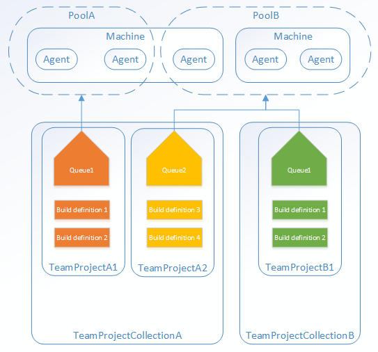

Azure Pipelines is a part of Azure DevOps service portfolio. [Azure Pipelines](https://docs.microsoft.com/en-us/azure/devops/pipelines/index?view=vsts) help you to build,configure and run your CI/CD (continuous integration / continuous delivery) processes for application development and infrastructure as code.

While build pipelines are used to compile and create working code, deployment pipelines install or deploy the working code to a target application, web service, container or anything else which runs your code.<figure class="wp-block-image">

 <figcaption>image source: Microsoft</figcaption></figure> 

### Agents

To automatically build and release your code, you agents. For each stage (build/deploy) at least one. The agents execute the tasks you define within the pipeline definition. Therefore we speak about build-agents and release-agents. Agents provide run times for pipelines on VMs. There are various options to run a build- or release-pipeline:

#### Microsoft-hosted agents {#microsoft-hosted-agents}

With Microsoft-hosted agents, maintenance and upgrades are taken care of for you. Each time you run a pipeline, you get a fresh virtual machine. The virtual machine is discarded after the pipeline job has finished, either successfully or with errors. For many people this is the simplest way to build and deploy because you don&#8217;t have to care about the agents. The following operating systems can be selected as the agent os, depending on your needs and type of code you have to build or deploy.

  * Ubuntu 16.04 (`ubuntu-16.04`)
  * Visual Studio 2017 on Windows Server 2016 (`vs2017-win2016`)
  * macOS 10.13 (`macOS-10.13`)
  * Windows Server 1803 (`win1803`) &#8211; for running Windows containers
  * Visual Studio 2015 on Windows Server 2012R2 (`vs2015-win2012r2`)

While this sounds like a perfect solution, there are drawbacks as with every solutions. As we don&#8217;t have access to the virtual machine, we have limited access to the underlying operating system and limited options to install stuff we might need for our pipeline tasks. Additionally, if we have to install modules and other binaries first, those steps are repeated over and over again on each subsequent run of the pipeline job, as we remember, the agent vm is discarded behind the scenes. For details on limitations for Microsoft-hosted agents see here: [Capabilities and Limitations](https://docs.microsoft.com/en-us/azure/devops/pipelines/agents/hosted?view=vsts&tabs=yaml#capabilities-and-limitations)

## Self-hosted agents {#install}

An agent that you set up and manage on your own to run build and deployment jobs is a&nbsp;**self-hosted agent**. Running as a virtual machine they can run on-premises or on any cloud of your choice. You simply install a DevOps agent binary and connect the agent to your Azure DevOps agent pool. Self-hosted agents give you more control to install dependent software required for your build and release jobs. Again, we have several options for the operating system hosting the agent service:

  * [macOS agent](https://docs.microsoft.com/en-us/azure/devops/pipelines/agents/v2-osx?view=vsts)
  * [Red Hat agent](https://docs.microsoft.com/en-us/azure/devops/pipelines/agents/v2-linux?view=vsts)
  * [Ubuntu 14.04 agent](https://docs.microsoft.com/en-us/azure/devops/pipelines/agents/v2-linux?view=vsts)
  * [Ubuntu 16.04 agent](https://docs.microsoft.com/en-us/azure/devops/pipelines/agents/v2-linux?view=vsts)
  * [Windows agent v2](https://docs.microsoft.com/en-us/azure/devops/pipelines/agents/v2-windows?view=vsts)

Self-hosted agents maximise your flexibility in terms of required, depended software and 3rd party tools you might use for your job tasks. The downside of this, you have to run and take care about the agent VMs, which is of course less cost-optimised.

#### Agent Pools

Self-hosted agents can be grouped into agent pools. When you create a build or release pipeline, you specify which pool it uses to run the jobs.<figure class="wp-block-image">

 <figcaption>image source: Microsoft</figcaption></figure> 

Typical use cases, where you want to create agent pools are:

  * Segregation of duty (different teams use and manage agents)
  * Isolation / Security (you don&#8217;t want to share sensitive credentials and code among different teams)
  * Load balancing and high availability (one is still one &#8211; if it fails there is no more)

### Agents on Azure Container Instances (ACI)

Recently I read a [blog post](https://blogs.msdn.microsoft.com/devops/2019/01/07/azure-devops-agents-on-azure-container-instances-aci/) from [Mate Barabas](https://social.msdn.microsoft.com/profile/M%C3%A1t%C3%A9+Barab%C3%A1s) on how to use ACI for DevOps Pipleines. If you don&#8217;t know about Azure Container Instances you might want to have a look at the [official docs here](https://docs.microsoft.com/en-us/azure/container-instances/). In short, ACI are single use purpose container instances, without any need to care about the container host os. If you do not need any orchestration for app deployment and maintenance, they provide a flexible pay-as-you-use container solution.

#### The beauty of running DevOps agents on ACI

Having DevOps agents running on ACI is the king-way of using Self-hosted agents (IMHO). Why I like this so much? Well, it&#8217;s scalable, flexible (you can use Windows or Linux containers) and on top, it&#8217;s more cost effective because you don&#8217;t have spin up and pay virtual machine instances which bum around most of the time.

### Wrap Up

Azure DevOps has a lot of flexible options to run your build and release (deployment) jobs. The pipeline definitions have jobs with tasks which have to run somewhere. Either on

  * Microsoft-hosted agents (on Azure)
  * Self-hosted agents (on-premises or on any cloud)
  * Self-hosted agent running on ACI

Hope to have you back for later posts, where I&#8217;m going to cover Azure DevOps Pipelines in more detail. Stay tuned!