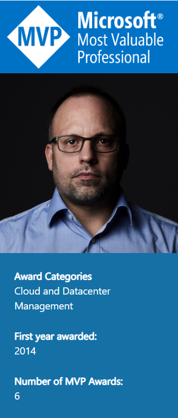

Getting up early this morning was worth it. As per 1st of July all Microsoft MVPs are curious if they contributed enough to the community to become re-awarded for another year, I got THIS! 🙂 . Awarded for the 6th time in a row, I&#8217;m really honored and proud to be a part of an exclusive group of smart people from all over the world. Being in close contact with the Microsoft product groups also helps me in my day to day life. Also the annual MVP Summit conference provides a unique opportunity to meet my MVP fellows and the people from the PGs in person and discuss the latest and greatest and to handover feedback.<figure class="wp-block-image is-resized">

 </figure>