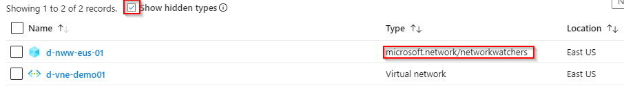

Network Watcher is a regional service that enables you to monitor and diagnose conditions at a network scenario level in, to, and from Azure. Scenario level monitoring enables you to diagnose problems at an end-to-end network level view. Network diagnostic and visualization tools available with Network Watcher help you understand, diagnose, and gain insights to your network in Azure. Network Watcher is enabled through the creation of a Network Watcher resource. This resource allows you to utilize Network Watcher capabilities. 

By default, a resource group called &#8220;NetworkWatcherRG&#8221; is created automatically, the first time you create a virtual network in your subscription. This might or might not be a desired behavior, especially when you govern your environment using Azure Policies.

I recently came across an annoying issue with Azure Network Watcher when having Azure Policies in place that required certain tags to be submitted on resource / resource group creation.

When trying to enable the NetworkWatcher for a new region, the request got denied:  

>  Resource 'NetworkWatcherRG' was disallowed by policy 

The reason for this, the Network Watcher is a hidden resource, but still it is a resource which has to live inside a resource group. Microsofts automatically created a resource group with the name &#8220;NetworkWatcherRG&#8221;. So first, the name of the resource group is not compliant with my naming standards, secondly I&#8217;m enforcing certain tags to be set, when a resource group is created. That&#8217;s why this failed.

## How to make it the &#8220;compliant&#8221; way.

### 1. Disable automatic creation of Network Watcher

  Disclaimer! Once you opted out of the automatic creation, you have to contact support to have it back &#8220;opted in&#8221;

**PowerShell**

Register-AzProviderFeature -FeatureName DisableNetworkWatcherAutocreation -ProviderNamespace Microsoft.Network
Register-AzResourceProvider -ProviderNamespace Microsoft.Network


**Azure CLI**

az feature register --name DisableNetworkWatcherAutocreation --namespace Microsoft.Network
az provider register -n Microsoft.Network


### 2. Automate Network Watcher instance creation

Whatever process and tools you choose, ensure every subscription gets his resource group for the network watcher instances. I&#8217;d recommend to choose the resource group where you put your other network core resources in, such as network gateways and firewalls. I&#8217;m using Azure Blueprints to ensure, every new subscription get&#8217;s the basic resources and policies assigned.<figure class="wp-block-image">

 </figure> 

You can find an example blueprint to achieve this in my Github repo <a href="https://github.com/drmiru/AzureBlueprints/tree/master/blueprints/NetworkWatcher" target="_blank" rel="noreferrer noopener" aria-label="here (opens in a new tab)">here</a>