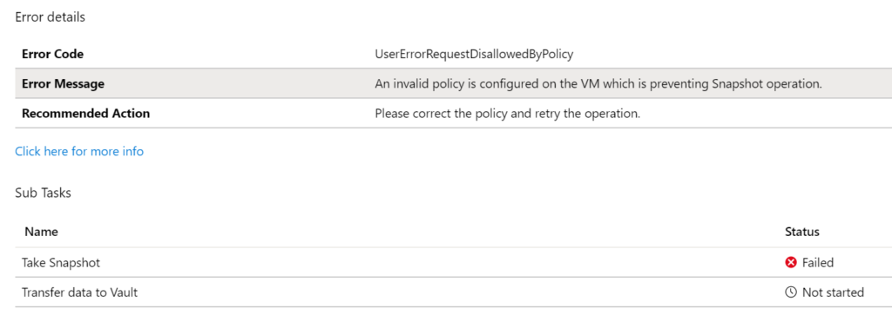
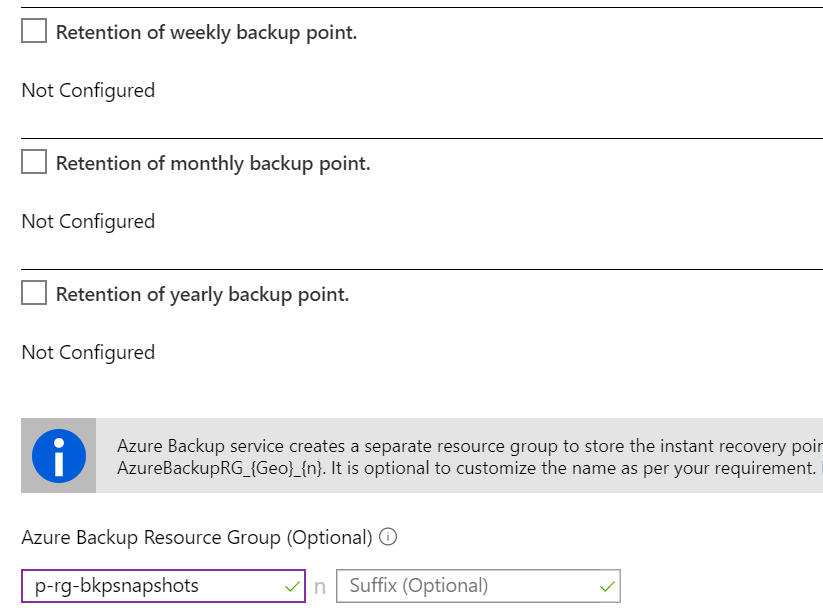

Recently I received a support request from a customer &#8211; backup jobs of Azure VMs where failing. Some of the jobs where still working as expected, while others suddenly where not. The following error message was logged in the job log:<figure class="wp-block-image">

 </figure> 

Digging into the Azure activity log showed a possible root cause.

>  "Failure Details": "An invalid policy is configured on the VM which is preventing Snapshot operation. Please correct the policy and retry the operation."

### What happened?

Azure Backup service creates a separate resource group (RG), different than the resource group of the VM to store the restore point collection (RPC). This process occurs automatically whenever the first backup job within a Azure Site Revovery Vault starts. The RPC houses the instant recovery points of protected VMs. The default naming format of the resource group created by the Backup service is: `AzureBackupRG_<Geo>_<number>`. For example: _AzureBackupRG\_westeurope\_1_

This, such as other automated resource creations like NetworkWatcher, is not really cool if you have Azure policies in place where you restrict resource creation. In this example, the customer had a tagging policy assigned to a management group, enforcing certain tag values to be submitted on creation of a new resource group. 

### How to avoid this

While still keeping the tagging policy in place, the only workaround is to create the resource group manually, according to the required naming schema by Azure Backup Service.

<rg name><n><optional suffix>


As an example, you might name your resource group as follows:

**p-rg-bkpsnapshots1**

Within each backup policy, you then have to manually override the default group:<figure class="wp-block-image">

 </figure>