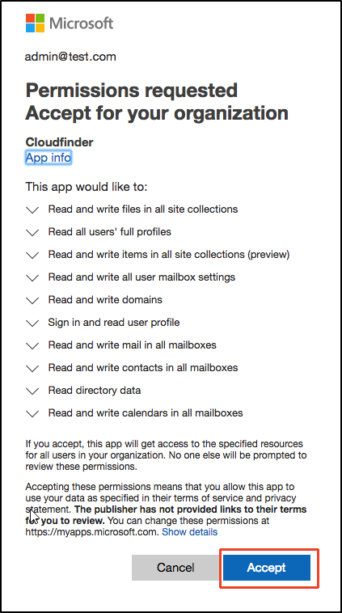
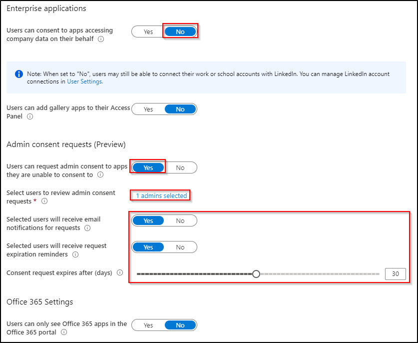

Applications can integrate with the Microsoft Identity platform to allow users to sign in using their work or school account in Azure Active Directory (Azure AD), and to access your organization's data to deliver rich data-driven experiences. Different permissions allow the application different level of access to your users' and your organization's data.

By default, users can consent to applications accessing your organization's data, although only for some permissions. For example, by default a user can consent to allow an app to access their own mailbox or the Teams conversations for a team the user owns. 
We all know the beloved message below:

{:class="img-responsive"}

While this is convinient for the administrators, it introduces a security problem. Consider the following scenario:

- An attacker manages to register a new application in azure AD that requests access to users information and data
- The attacker tricks the end user into granting consent to sensitive data
- The attacker has now user-level access to information and data without the need for an organizational account

## Mitigation

To get rid of this potential threat, we can use a new feature (currently in preview) called "Admin Consent Requests".

By disabling user-initiated consent, we can let the users request the consent to an application. Selected Admin will then receive a notification email and can grant/decline the request.

{:class="img-responsive"}

> Users with the following Azure AD Roles can receive and approve such requests: Global Administrator, Application Administrator, Cloud Application Administrator
