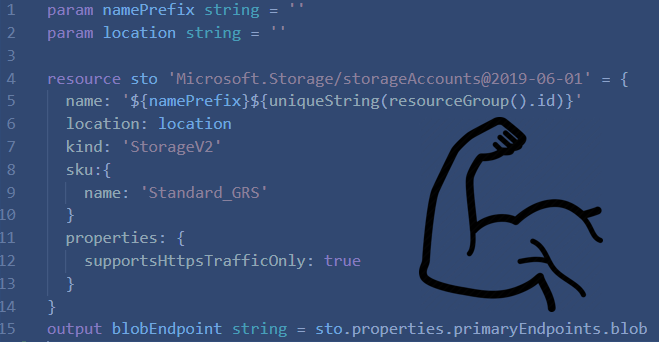
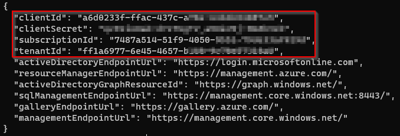
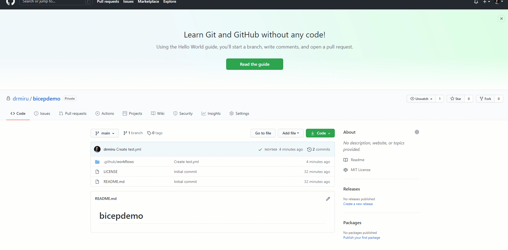

<span style="display:block;text-align:center"></span>


In this post I'm going to demonstrate how to use Azure "bicep" together with Github actions for pipeline based infrastructure deployments using the new bicep language. 

## Bicep
Project "Bicep" is a new project from Microsoft for declarative, template based IaC (Infrastructure as Code). It's basically a language wrapper for ARM templates. ARM templates are widely used but at the mean time, they're also kind of "hard to learn", especially for beginners. As bicep is not a custom IaC provider such as Terraform or Pullumi are, the unerlying architecture of ARM (Azure Resource Manager) is not touched or changed.
Bicep mainly consist of the two following components:

- Visual Studio Code Extention (language interpreter)
- Compiler (converts .bicep files into native .json arm templates)

### Why bicep
When we have a closer look under the hood, Terraformers will notice, that Microsoft took a lot of the good things of HCL (Hashi Corp Language) over to bicep. The language is way more simpler and readable than json, and provides functionalities we always asked for when using native ARM templates.

The following example shows a virtual network with two subnets:
```yaml
param vnetName string
param addressPrefixes array
param subnet1Name string
param subnet2Name string
param subnet1AddressPrefix string
param subnet2AddressPrefix string
param location string = '${resourceGroup().location}'

resource vnet 'Microsoft.Network/virtualNetworks@2020-06-01' = {
  location: location
  name: vnetName
  properties:{
    addressSpace:{
      addressPrefixes:addressPrefixes 
    }
    subnets:[
      {
        name:subnet1Name
        properties:{
          addressPrefix: subnet1AddressPrefix          
        }
      }
      {
        name:subnet2Name
        properties:{
          addressPrefix: subnet2AddressPrefix          
        }
      }
    ]    
  }
}
```
While for beginners, the code still may look complicated, bicep shows it's real power in the details. Just to mention a few of them:

- dependencies are automatically resolved
- variables can be references by just typing their names
- concat is not required any more, instead strings can be combined with interpolated variables or parameters
- Referenced resources or modules are automatically compiled as child or nested resources 

> Disclaimer: Project "bicep" is still in public preview and you should not use it for critical production deployments. But to mention, it's quite stable already and a lot of core functionalities are implemented already.

## Github Actions
As a lot of you might have noticed alreay, Microsoft is pushing Github a lot since the acquisition back in 2018.
Github Actions are the version of Azure DevOps Pipelines. Configured as YAML code files, the are very similar to Azure DevOps or Gitlab pipelines, although syntax and functionalities differ a bit between the platforms.

Example:
```yaml
name: AzureDeploy

on:
  push:
    branches: [ main ]
  pull_request:
    branches: [ main ]

jobs:
  deploy:
    runs-on: ubuntu-latest
    steps:
      - uses: actions/checkout@v2

      # Log into Azure
      - uses: azure/login@v1
        with:
          creds: ${{ secrets.AZURE_CREDENTIALS }}

      # Deploy ARM Template
      - name: Deploy Azure Resource Manager (ARM) Template
        uses: Azure/arm-deploy@v1
        with:
          scope: subscription
          region: westeurope
          subscriptionId: 7487a514-51f9-4050-9bb1-79de33af929d
          template: ./201-VirtualNetworksWithPeering/main.json     
```

## Demo case

In this demo scenario I will demonstrate the following use case:
- Use bicep modules to achieve a modular template structured approach
- Create two virtual networks including peering using a master template with referenced modules
- Use Github Actions for CI/CD

### (1) Installing nigthly bicep builds
https://github.com/Azure/bicep/blob/main/docs/installing-nightly.md

### (2) Creating bicep modules
If you want to start with the basics I recommend the following read.
https://github.com/Azure/bicep

For now we will have a look at modules.
A module is nothing more than a single .bicep file (template) which can be references in a main template later. So let's create the first component template, a virtual network with two subnets.

```yaml
param vnetName string
param addressPrefixes array
param subnet1Name string
param subnet2Name string
param subnet1AddressPrefix string
param subnet2AddressPrefix string
param location string = '${resourceGroup().location}'

resource vnet 'Microsoft.Network/virtualNetworks@2020-06-01' = {
  location: location
  name: vnetName
  properties:{
    addressSpace:{
      addressPrefixes:addressPrefixes 
    }
    subnets:[
      {
        name:subnet1Name
        properties:{
          addressPrefix: subnet1AddressPrefix          
        }
      }
      {
        name:subnet2Name
        properties:{
          addressPrefix: subnet2AddressPrefix          
        }
      }
    ]    
  }
}
```

--> Save the file as virtualNetwork.bicep

As a second module we create a template for vNet peering.

```yaml
param localVnetName string
param remoteVnetName string
param remoteVnetRg string

resource peer 'microsoft.network/virtualNetworks/virtualNetworkPeerings@2020-05-01' = {
  name: '${localVnetName}/peering-to-remote-vnet'
  properties: {
    allowVirtualNetworkAccess: true
    allowForwardedTraffic: true
    allowGatewayTransit: false
    useRemoteGateways: false
    remoteVirtualNetwork: {
      id: resourceId(remoteVnetRg, 'Microsoft.Network/virtualNetworks', remoteVnetName)
    }
  }
}
```

### (3) Referencing bicep modules in main template

Now let's create the main file in which we are going to reference the modules. Modules are referenced using the "module" prefix followed by the relatove path to the module, the component .bicep file. Additionally, the following examples contains some other specialities covered.

- Creation of two resource groups
- Multi-RG deployment
- Custom Dependencies for Peering

```yaml
targetScope = 'subscription'

param rg1Name string
param rg1Location string = 'westeurope'
param rg2Name string
param rg2Location string = 'westeurope'
param vnet1Name string
param vnet2Name string

resource rg1 'Microsoft.Resources/resourceGroups@2020-06-01' = {
  name: '${rg1Name}'
  location: '${rg1Location}'
} 

resource rg2 'Microsoft.Resources/resourceGroups@2020-06-01' = {
  name: '${rg2Name}'
  location: '${rg2Location}'
} 


module vnet1 '../101-resourcelibrary/virtualNetwork2Subnets.bicep' = {
  name: 'vnet1'
  scope: resourceGroup(rg1.name)
  params:{
    vnetName: vnet1Name
    addressPrefixes:[
    '10.0.0.0/8'
    ]
    subnet1Name:'d-sne${vnet1Name}-01'
    subnet2Name:'d-sne${vnet1Name}-02'
    subnet1AddressPrefix: '10.1.1.0/24'
    subnet2AddressPrefix: '10.1.2.0/24'
  }
}

module vne2 '../101-resourcelibrary/virtualNetwork2Subnets.bicep' = {
  name: 'vnet2'
  scope: resourceGroup(rg2.name)
  params:{
    vnetName: vnet2Name
    addressPrefixes: [
      '172.16.0.0/16'
    ]
    subnet1Name:'d-sne${vnet2Name}-01'
    subnet2Name:'d-sne${vnet2Name}-02'
    subnet1AddressPrefix: '172.16.1.0/24'
    subnet2AddressPrefix: '172.16.2.0/24'
  }
}

module peering1 '../101-resourcelibrary/vnetPeering.bicep' = {
  name: 'peering1'
  scope: resourceGroup(rg1.name)
  dependsOn:[
    vnet1
    vne2
  ]
  params:{
    localVnetName:vnet1Name
    remoteVnetName: vnet2Name
    remoteVnetRg: rg2Name
  }
}

module peering2 '../101-resourcelibrary/vnetPeering.bicep' = {
  name: 'peering2'
  scope: resourceGroup(rg2.name)
  dependsOn: [
    vne2
    vnet1
  ]
  params:{
    localVnetName:vnet2Name
    remoteVnetName: vnet1Name
    remoteVnetRg: rg1Name
  }
}
```

### (4) Compile bicep main file

Compiling the main bicep together with all referenced modules is as easy as follows:

```PowerShell
bicep compile .\main.json
```

This command validates the syntax and creates a resulting, single, json ARM template.

### (5) Deploy the compiled json file
Deploying the compiled json is nothing different that using native ARM templates.

```PowerShell
New-AzDeployment -Name "vnetDemo" -location westeurope -TemplateFile .\main.json -rg1Name d-rgr-corenet-01 -vnet1Name d-vne-core-01 -rg2Name d-rgr-spokenet-01 -vnet2Name d-vne-spoke-01
```
You can also use Azure CLI of course instead of PowerShell. Additionally you might want to use the <b>-whatif</b> parameter first, so you can evaluate the predicted results, before really deploying the template.

### (6) Creating the Github Action Workflow

The last step is to create a CI/CD Pipeline for our bicep demo environment. The workflow will contain two main jobs:
- build (bicep compile)
- deploy (deploying the compiled ARM template)

First we need to create a service principal with contributor permissions on the target subscription:

```PowerShell
az ad sp create-for-rbac --name GithubBicepDemo --role contributor --scopes /subscriptions/{your subscription-id} --sdk-auth
```
We need to note the following parameters of the output:



Ok, next, we're going to add the credentials as a github protected credential object:




The last step is to create the Github Actions Workflow, in fact the CI/CD pipeline. You can use this example as your general workflow template for bicep based ARM deployments.

```yaml

name: AzureDeploy
env:
  subscriptionId: '<your subscription ID goes here>'
  bicepFile: './201-VirtualNetworksWithPeering/main.bicep'
  armtemplateFile: './201-VirtualNetworksWithPeering/main.json'

on:
  push:
    branches: [ main ]
  pull_request:
    branches: [ main ]

  # Allows you to run this workflow manually from the Actions tab
  workflow_dispatch:

jobs:
  build:
    runs-on: ubuntu-latest

    steps:
      - uses: actions/checkout@v2
     
      - name: Bicep Build
        uses: aliencube/bicep-build-actions@v0.1
        with:
          files: ${{ env.bicepFile }}
      
      #create artifact tar
      - name: 'Tar files'
        run: tar -cvf bicep-artifacts.tar ./

      #upload artifacts
      - name: Upload Artifacts
        uses: actions/upload-artifact@v2
        with:
          name: bicep-artifacts
          path: bicep-artifacts.tar
      
  deploy:
    runs-on: ubuntu-latest
    needs: build

    steps:
      # download & exract build artifacts
      - uses: actions/download-artifact@v2
        with:
          name: bicep-artifacts
      
      # Extract files from build tar
      - name: 'Extraxt Files'
        run: tar -xvf bicep-artifacts.tar
      
      # Login to Azure
      - uses: azure/login@v1
        with:
          creds: ${{ secrets.AZURE_CREDENTIALS }}

      # Deploy compiled ARM Template
      - name: Deploy Azure Resource Manager (ARM) Template
        uses: Azure/arm-deploy@v1
        with:
          scope: subscription
          region: westeurope
          subscriptionId: ${{ env.subscriptionId }}
          template: ${{ env.armtemplateFile }}
```

## Decompiling existing ARM Templates

What if you already have a complementary libary of ARM templates and you wanted to have them as templates in bicep style?

Option 1: (decompile using bicep CLI)
```PowerShell
bicep decompile .\yourARMTemplate.json
```

Option 2: (Use Bicep Playgound)
https://bicepdemo.z22.web.core.windows.net/

## Conclusion

In this post I showed how to use bicep based templates including a modular approach by leveraging modules. Also I included a complete example how to automatically build/deploy a bicep solution using Github Actions (Workflows).
All the examples are available on my Github Account.
https://github.com/drmiru/bicepdemo

### Useful resources

Get started with Bicep:
https://github.com/azure/bicep

Get started with ARM deployments using Github Actions: 
https://docs.microsoft.com/en-us/azure/azure-resource-manager/templates/deploy-github-actions


> Stay tuned for more deep dive on bicep usage!


