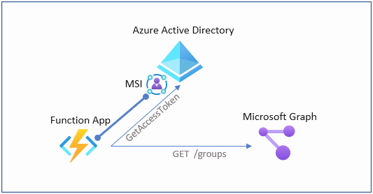

<span style="text-align:center"></span>

In this post I'm going to show how to use a MSI with PowerShell on Azure Functions to generate oAuth access tokens for Graph API access.

## MSI
Managed Service Identities (MSI) aka "Azure AD-managed identities" eliminate the need for developers having to manage credentials by providing an identity for the Azure resource in Azure AD and using it to obtain Azure Active Directory (Azure AD) tokens. 
When using PowerShell in Azure Functions, MSI Authentication is a perfect way to authenticate against Azure AD and leverage RBAC of Azure AD and Azure ARM. But what if you want to access Microsoft Graph API using an MSI?

<b>Benefits of using Managed Identities</b>

- You don't need to manage credentials. Credentials are not even accessible to you.
- You can use managed identities to authenticate to any Azure service that supports Azure AD authentication. For a current list see: [Azure Services supporting MSI AuthN](https://docs.microsoft.com/en-us/azure/active-directory/managed-identities-azure-resources/services-support-managed-identities)
- Managed identities can be used without any additional cost.

More details on Managed Identities can be found here:
[Managed Identities](https://docs.microsoft.com/en-us/azure/active-directory/managed-identities-azure-resources/overview)

## MSI and Graph API Access - step by step
In order to generate an access token for Graph API using a MSI, we neet to use the following .Net core library:
- Microsoft.Azure.Services.AppAuthentication

(1) Let's create a function locally first (using function core tools in this example)
```PowerShell
func init --worker-runtime powershell
func new --language powershell --name GetGraphToken --template httptrigger
```
(2) Create the Function App in Azure

```PowerShell
#create Functionapp with system assigned identity
$functionApp = az functionapp create --name 'myFunctionApp' --resource-group 'myRG' --storage-account 'myStorage12345' --os-type Windows --runtime powershell --runtime-version 7.0 --consumption-plan-location westeurope --functions-version 3 --assign-identity | convertfrom-json

#Assign identity (in case you have an already existing app)
az functionapp identity assign --resource-group 'myRG' --name 'myFunctionApp'
```
(3) Assign API Permissions

To access the Graph API we need to assign API permissions to the MSI of the Function App. In this demo we're going to assign the right to read all groups

```PowerShell
#Connect to Azure AD
Connect-AzureAD

#Get graph App
$graphApp = Get-AzureADServicePrincipal -Filter "AppId eq '00000003-0000-0000-c000-000000000000'"

#get Role to read group objects
$groupReadPermission = $graphApp.AppRoles | where-Object {$_.Value -eq "Group.Read.All"}

#use the MSI from the Function App Creation
$msi = Get-AzureADServicePrincipal -ObjectId $functionApp.identity.principalId

New-AzureADServiceAppRoleAssignment -Id $groupReadPermission.Id -ObjectId $msi.ObjectId -PrincipalId $msi.ObjectId -ResourceId $graphApp.ObjectId
```

(4) Add MSAL App AuthN library to the Function App Project

In this step, we are adding a .net core library which we need to create the token request using the MSI

```PowerShell
dotnet new console
dotnet add package Microsoft.Azure.Services.AppAuthentication --version 1.6.0
dotnet build
dotnet publish
```

(5) Create Function Code

Edit run.ps1 file and replace the code with the following snippet

```PowerShell
using namespace System.Net

# Input bindings are passed in via param block.
param($Request, $TriggerMetadata)

# Write to the Azure Functions log stream.
Write-Host "PowerShell HTTP trigger function processed a request."

# Interact with query parameters or the body of the request.
$Scope = $Request.Query.Scope
if (-not $Scope) {
    $Scope = $Request.Body.Scope
}
#If parameter "Scope" has not been provided, we assume that graph.microsoft.com is the target resource
If (!$Scope) {
    $Scope = "https://graph.microsoft.com/"
}

#Add .net core library
$authNdllPath = '.\bin\Debug\netcoreapp3.1\publish\Microsoft.Azure.Services.AppAuthentication.dll'
add-type -Path $authNdllPath
$tokenProvider = New-Object Microsoft.Azure.Services.AppAuthentication.AzureServiceTokenProvider('')
$accessToken = ($tokenProvider.GetAccessTokenAsync("$Scope")).Result

#Invoke REST call to Graph API
$uri = 'https://graph.microsoft.com/v1.0/groups'
$authHeader = @{
    'Content-Type'='application/json'
    'Authorization'='Bearer ' +  $accessToken
}
$result = (Invoke-RestMethod -Uri $uri -Headers $authHeader -Method Get -ResponseHeadersVariable RES).value
If ($result) {
    $body = $result
    $StatusCode = '200'
}
Else {
    $body = $RES
    $StatusCode = '400'
}

# Associate values to output bindings by calling 'Push-OutputBinding'.
Push-OutputBinding -Name Response -Value ([HttpResponseContext]@{
    StatusCode = $StatusCode
    Body = $body
})

```

(6) Publish Code to Functionapp
 
```PowerShell
func azure functionapp publish 'myFunctionApp'
```

(7) Test the Function
You can either call the function URL directly using the output from the publish command from the previous step or use the Azure Portal for debug/test, which I'm going to show in this case


> Note: Using MSI also presents a downside. You cannot debug / test the function locally on your functions core tools host, because the MSI concept does not work on your machine.


## Summary

In this we've seen how to use MSI (Managed Service Identities) to generate access tokens for Microsoft Graph API. Using this technique, we have a secure way to automate against MS Graph from Azure Functions. Although the case shows a PowerShell example, it works perfectly fine with c#.

You can find the code example on my Github Account:

[https://github.com/drmiru/AzureFunctions/tree/master/MSIAuthN](https://github.com/drmiru/AzureFunctions/tree/master/MSIAuthN)

As always, if you have comments, questions or you find bugs. Feel free to reach out via Github / Twitter or LinkedIn.
